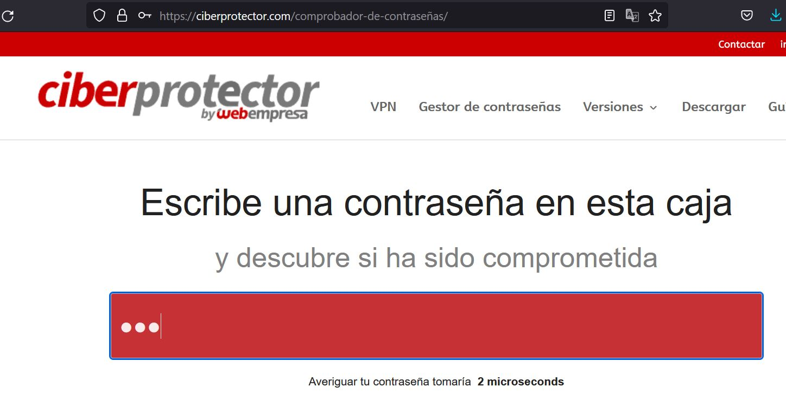
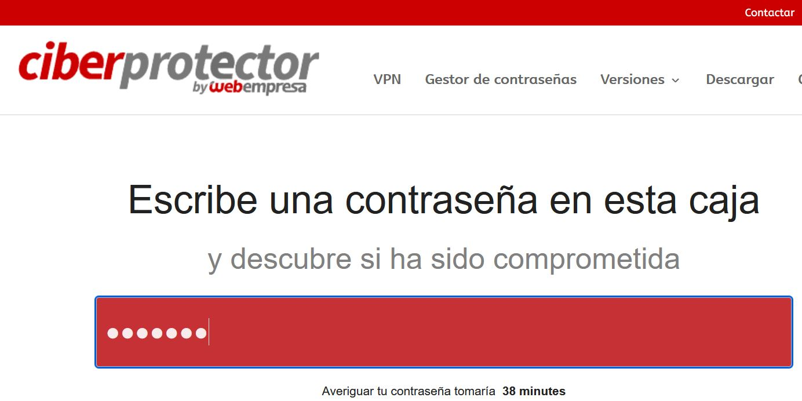
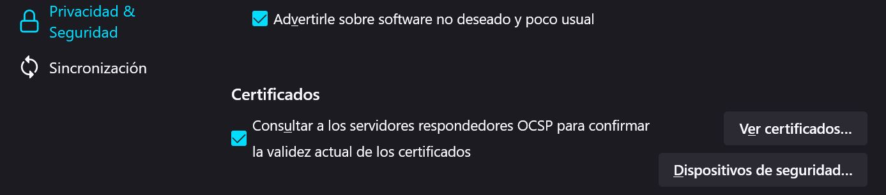

# UT1-A1. Introducción a la seguridad informática.

## 1- Busca en Internet alguna aplicación que muestre la fortaleza de una contraseña. Utilizando esa aplicación determina la fortaleza de una contraseña con las siguientes características:

Ciberprotector by webempresa.

### a) Tres caracteres en minúsculas.
Contraseña aaa "Se tardarian 2 microsegundos en averiguarla"

### b) Siete caracteres mezclando mayúsculas, minúsculas y caracteres especiales.
Contraseña T6y7u8. "Se tardarían 38min en averiguarla"

## 2- Describe detalladamente donde se pueden ver los certificados digitales que hay instalados en un navegador.

En FireFox hay que acceder al "menú de aplicación" (esquina superior derecha   -> "Ajustes" -> "Privacidad & Seguridad" -> "Seguridad" -> "Ver certificados".

## 3- Escribe tres acciones que mejorarían la seguridad de un sistema.

Cambio de puertos frecuentes.

Instalación de un VPN.

Cambio regular de contraseñas.

## 4- Pon un ejemplo de cada una de las siguientes amenazas:

### a) Interrupción.
Ruptura de hardware

### b) Interceptación.
Sniffers

### c) Modificación.
Modificación de bases de datos

### d) Fabricación.
Puertas traseras

## 5- Investiga en Internet y enumera tres sistemas de control de acceso para personas.

Clave por teclado

Tags de próximidad  

Biometría
## 6- Describe brevemente las partes más importantes de las que consta un grupo electrógeno.

Motor

Sistema eléctrico

Depósito de combustible

Sistema de refrigeración

Alternador

## 7- Investiga en qué consiste la tecnología de los “nanotubos” y su aplicación a la construcción de discos duros.

Se puede compactar más la información magnética calentando el disco al cambiar las propiedades magnéticas por el lubricante. ... Su desventaja es que si el disco aterriza y toca la superficie, al quedarse sin lubricante por la evaporación, se perderán todos los datos.

## 8- ¿Cuántas claves serían necesarias para que 3 personas se intercambiaran información utilizando cifrado simétrico? ¿Y si fuesen 4 personas?

a) 4 claves

b) 6 claves

## 9- Describe detalladamente cómo conseguir un certificado digital para una persona jurídica.

Configuración previa. ...

Solicitud vía internet de su Certificado. ...

Acreditación de la identidad. ...

Descarga de su Certificado.

## 10- Descarga la herramienta The Forensic ToolKit, instálala en tu equipo y ejecútala. Describe la salida de un comando.
