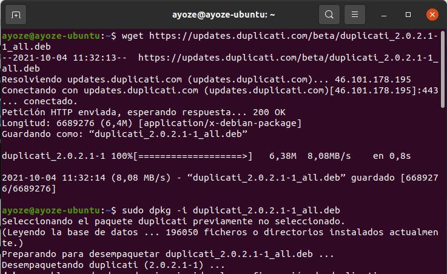
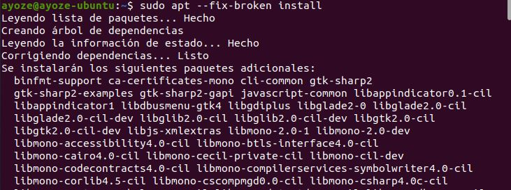
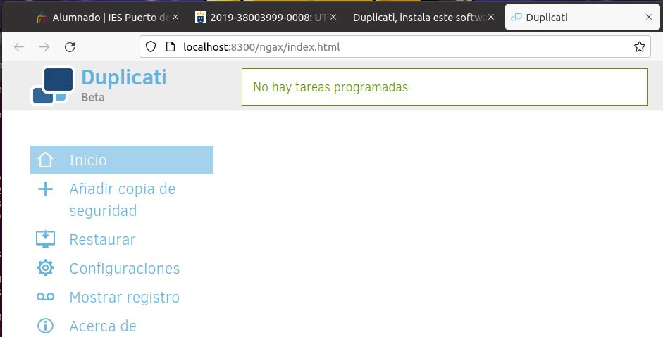
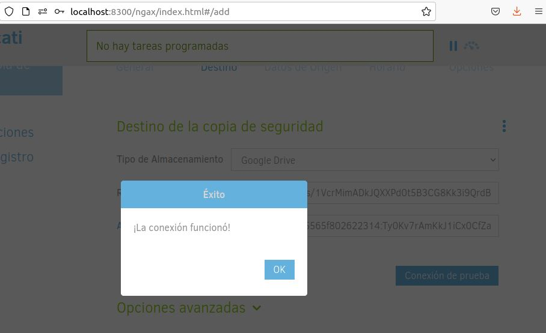
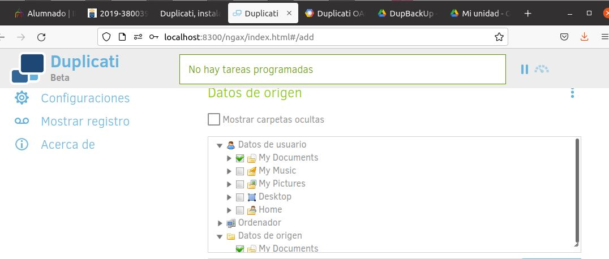
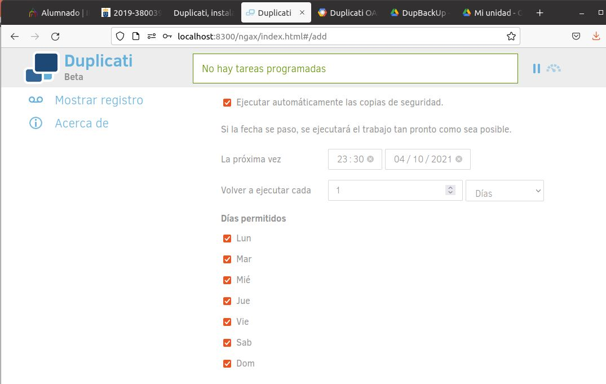
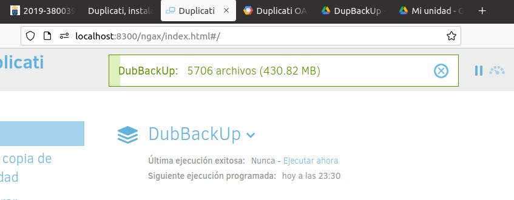

# UT1-A2. Copias de seguridad cifradas con Duplicati.

Para instalar Duplicati en nuestra máquina Ubuntu, nos descargamos los paquetes desde su repositorio oficial y lo desempaquetamos.

Al haber instalado una versión obsoleta nos da problemas de dependencias. Para solucionarlo, ejecutamos los siguientes comandos.

Al ejecutar el programa vemos que se ejecuta sin problemas.

Vamos a la pestaña añadir una copia de suguridad, y marcamos la casilla configurar nueva copia  de seguridad.

Establecemos un nombre para la copia, y configuaramos el tipo de cifrado y una frase como contraseña.

Mediante credenciales permitimos el acceso a duplicati a nuestro servicio de almacenamiento online.

Ahora seleccionamos los archivos que queremos guardar en nuestra copia de seguridad.

Programamos la frecuencia y la hora en la que se ejecutaran nuestras copias.

Y una vez realizados todos los ajustes, ejecutamos manualmente nuestra primera copia de seguridad, y comprobamos que efectivamente se ha realizado con éxito.

