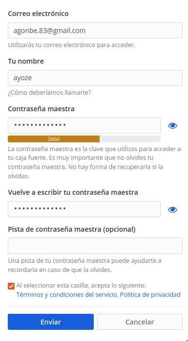
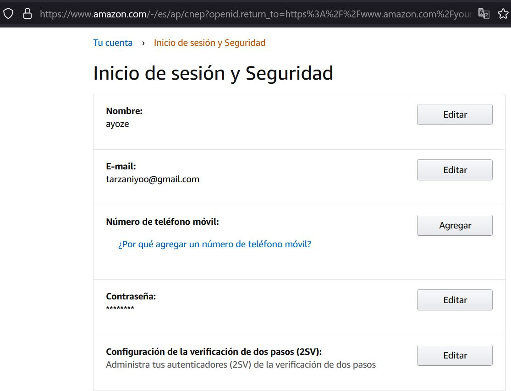
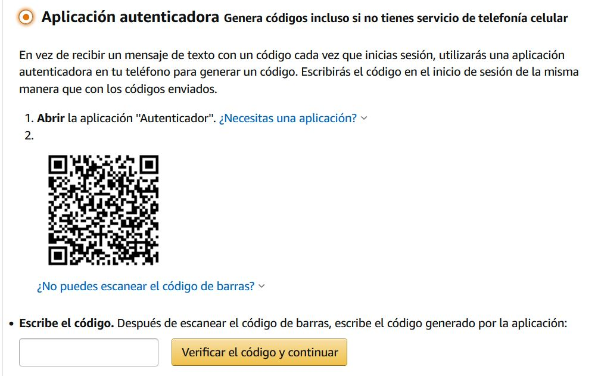
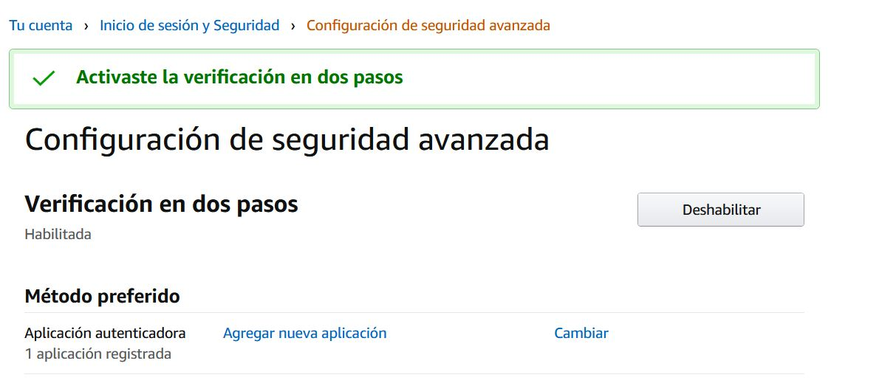
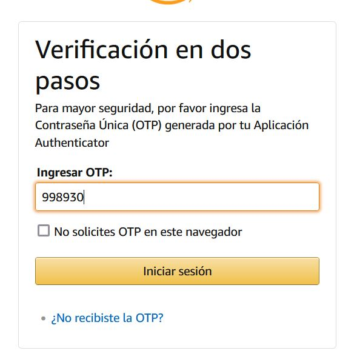

# UT2-A2. Bitwarden como gestor de contraseñas y la 2FA ( autenticación de doble factor )

Para está práctica vamos a descargar una herramienta para nuestro navegador (en nuestro caso Firefox) que nos ayudara a guardar de manera segura nuestras contraseñas de internet.

Para ello nos dirigimos a la página oficial de bitwarden y buscamos en la pestaña download, el instalador para nuestro navegador. Automáticamente se nos abrira la sección de complementos de firefox donde podremos agregarlo.

Una vez instalado, nos registramos con un correo, nombre de usuario y contraseña del servicio.

Para comprobar el servicio, nos registramos en alguna página de internet (en nuestro caso, www.jkanime.com) y guardamos los datos de acceso en nuestro gestor de contraseñas.
Ahora al querer logearnos en la página podemos copiar los datos facilmente desde nuestro gestor.

Ahora en nuestro movil, nos dirigimos a la playstore y buscamos **Authy**, una herramienta que nos proporciona la autentificación de doble factor. Lo instalamos y creamos una cuenta de usuario.

En la práctica propuesta, debiamos configurar la **2fa** en nuestra cuenta de gmail, pero trás mucho investigar no encontré la opción para usar está herramienta como autentificador. En su lugar habilité la autentificación en mi cuenta de **amazon.com** que si permite herramientas de terceros.

Para ello, escaneamos con nuestra aplicación, el codigo qr que nos muestra la página web durante la activación del proceso, e introducimos el codigo que nos muestra la aplicación.

Una vez activado el servicio, y guardados los datso de acceso en nuestro gestor **Bitwarden**, intentamos loguearnos de nuevo, y comprobamos que efectivamente la página nos pide ingresar un codigo que la app de authy ha generado automáticamente.

**NOTA**

No se pudieron subir capturas de la aplicación del teléfono movil, ya que no están permitidas por el sistema al contener datos personales.
