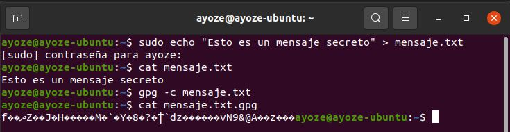
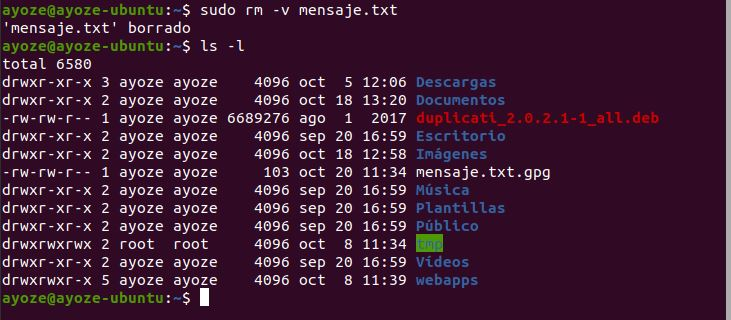
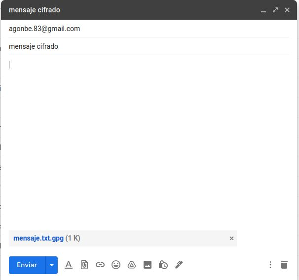
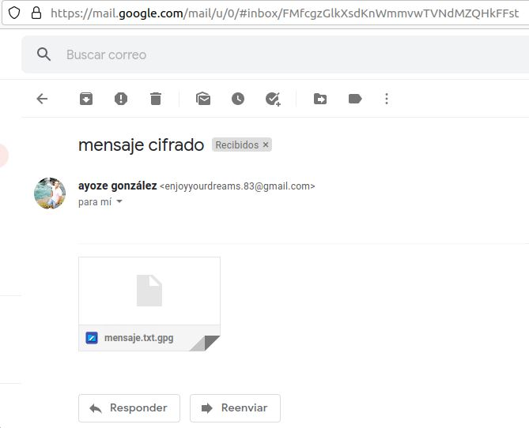
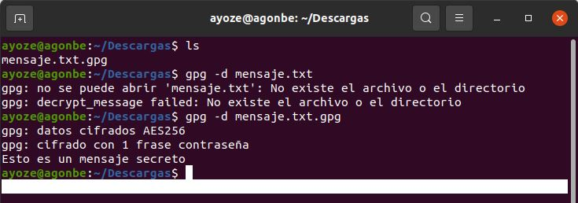

**UT2-A3 .Cifrado simétrico de archivos con Seahorse en Linux**

Para cifrar un mensaje en linux, contamos con la herramienta Seahorse que ya viene preinstalada en las ultimas distribuciones del sistema.

Lo primero que haremos será crear un archivo de texto, y luego ejecutamos el comando ***gpg -c "nombre_del_archivo"*** para cifrarlo. Nos pedirá contraseña durante el proceso.

Una vez tengamos creado el archivo cifrado, podemos eliminar el original.

Para probarlo mandaremos el archivo a un compañero.

Para desencriptarlo tendra que ejecutar el comando ***gpg -d "nombre_del_archivo"*** e introducir la contraseña que previamente hemos adjudicado.

