**UT2-A4. Clonación de discos mediante CLONEZILLA**

Vamos a realizar una copia de un disco duro, alojandola en un servidor remoto mediante ssh.  
Para ello lo primero que haremos será instalar el servicio ***openssh-server*** en nuestro servidor.

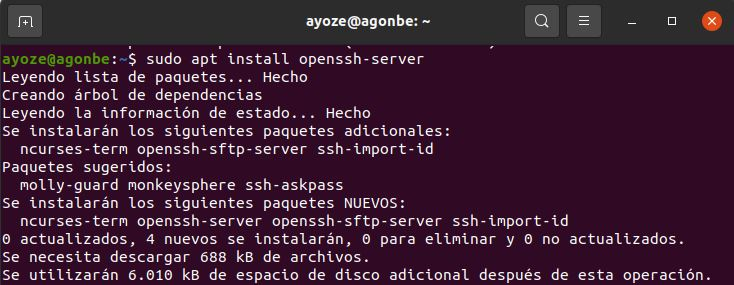

Ahora crearemos nuestro usuario del sistema.

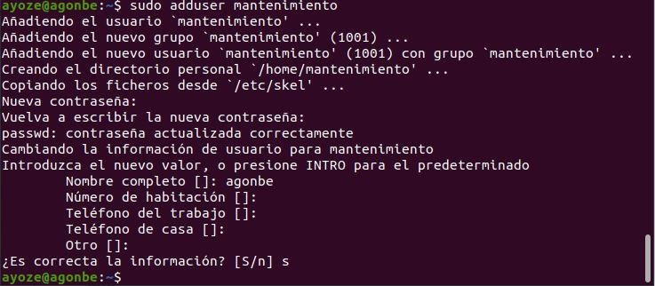

Y crearemos la carpeta donde alojaremos las copias de seguridad.

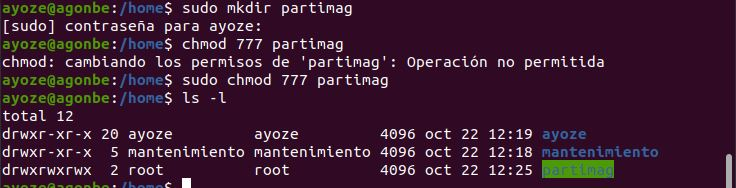

Sin apagar nuestro servidor, conectamos la máquina desde la cual realizaremos la copia.  
En la configuración de la máquina añadimos un nuevo disco duro y le damos formato.

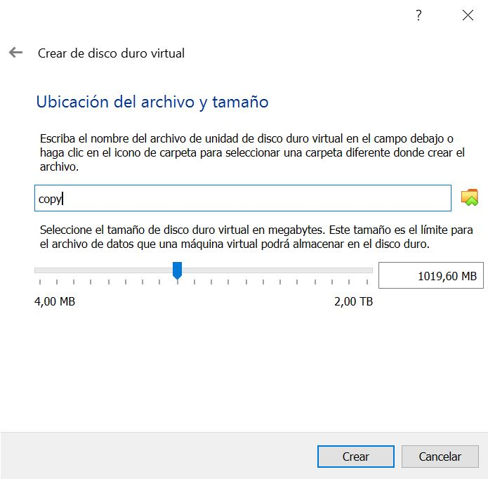

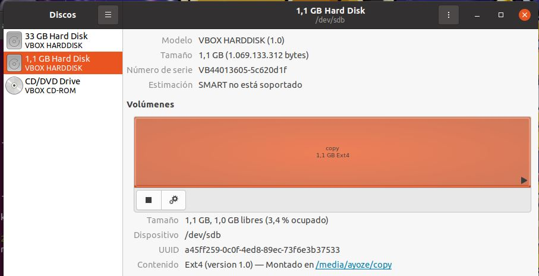

En la pestaña dispositivos añadimos el disco de ***clonezilla-live*** que previamente debemos tener descargado en le pc, y reiniciamos para que se inicie el asistente.
A cada paso, nos dará varias opciones, he iremos marcandolas como en las imagenes.

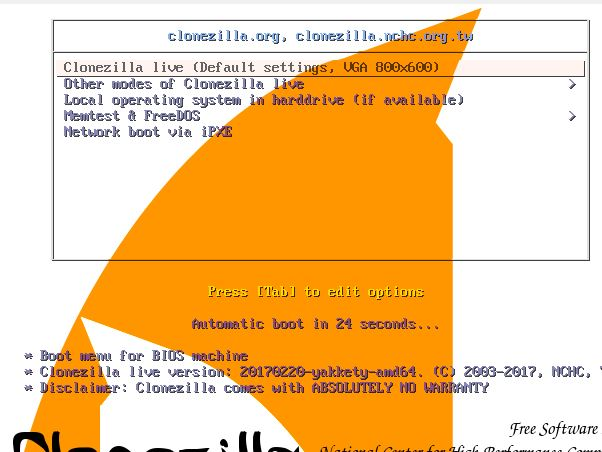

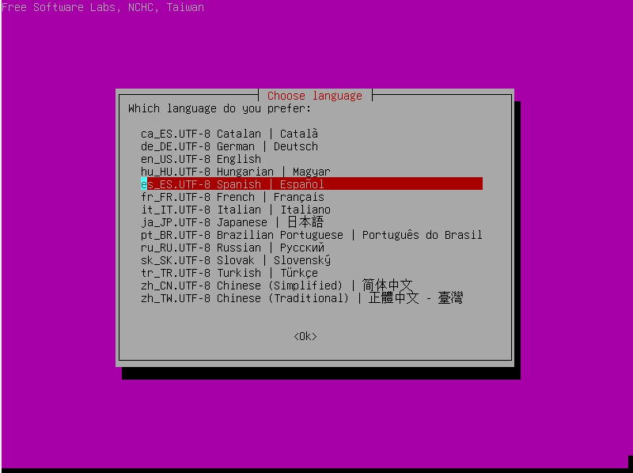

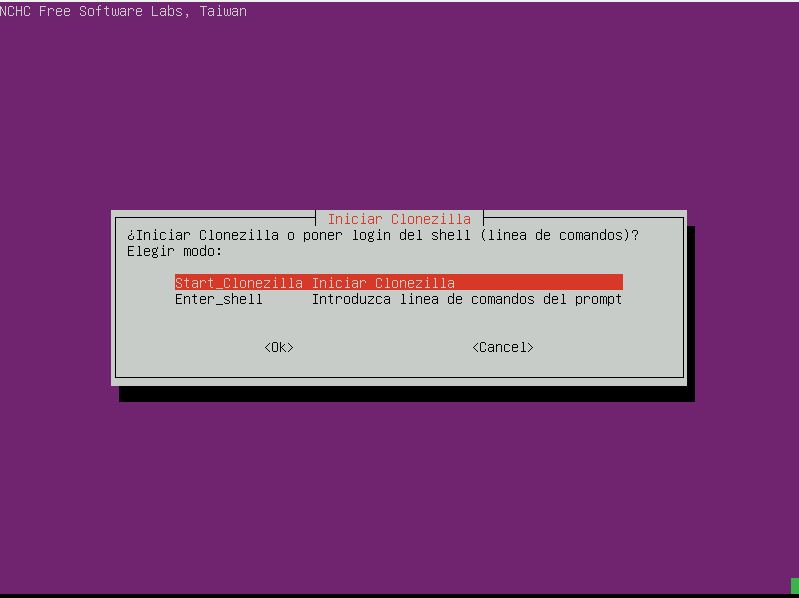

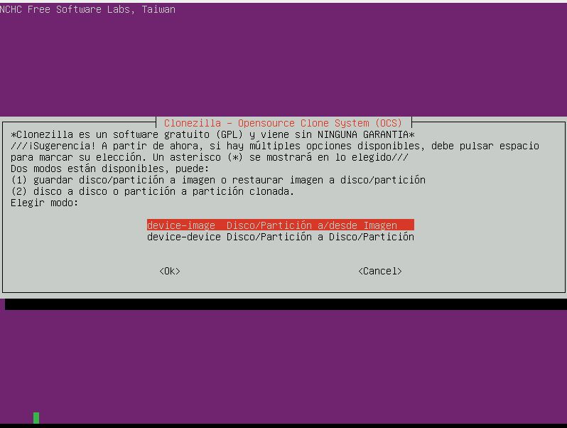

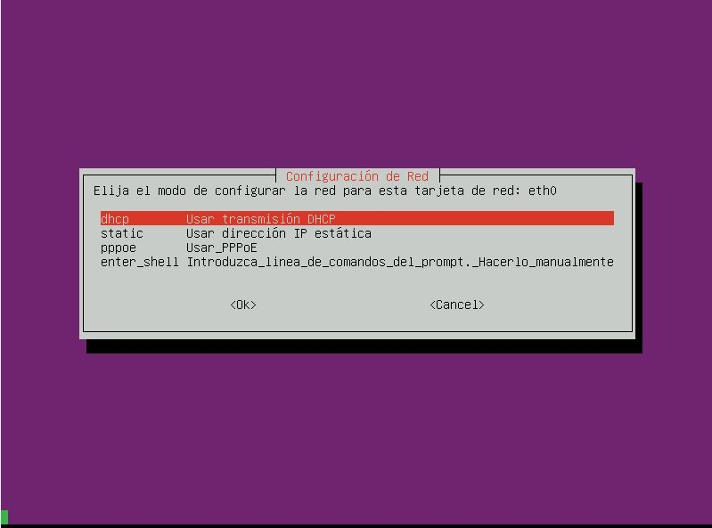

En esté paso nos pide la direcci
on ip del servidor.

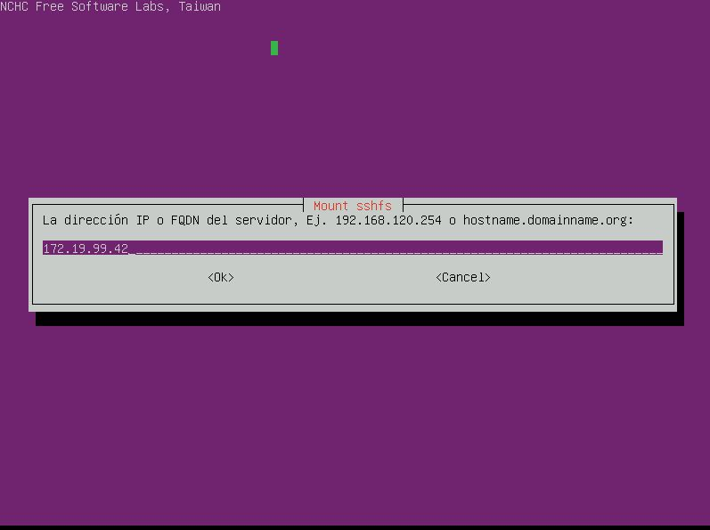

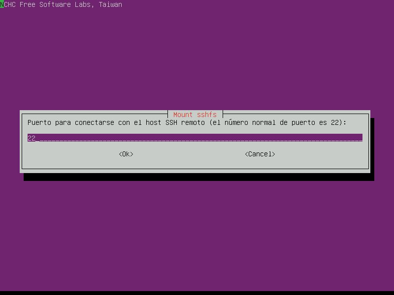

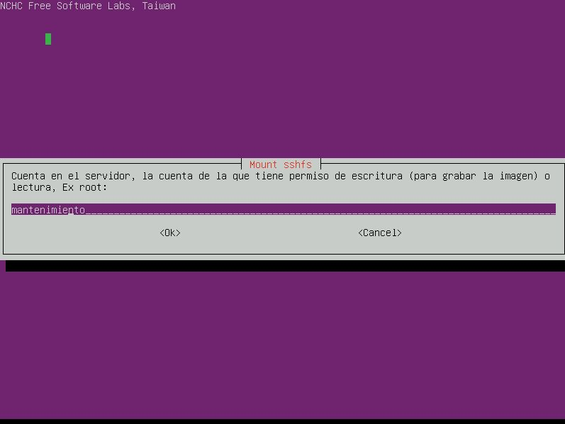

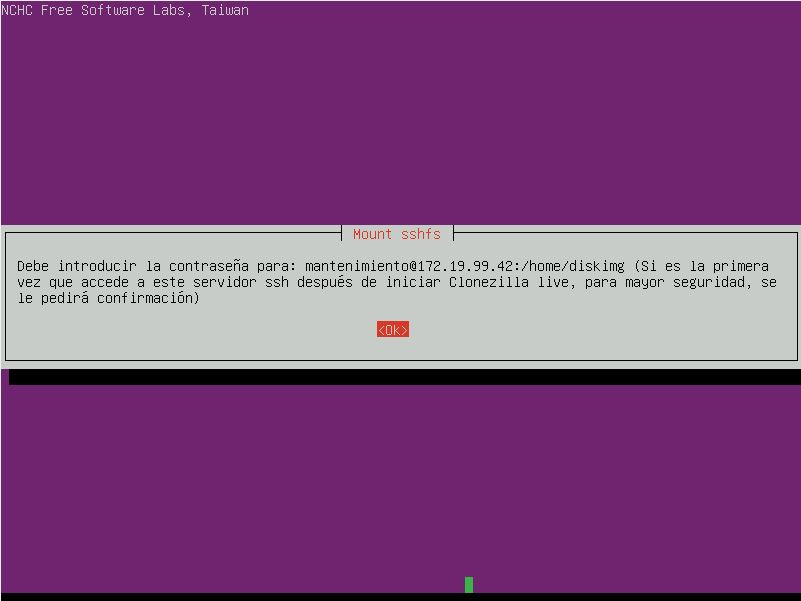

Ahora introducimos nuestra contraseña y seguimos las instrucciones del asistente.

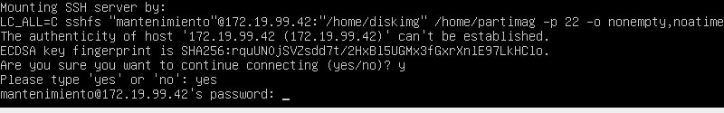

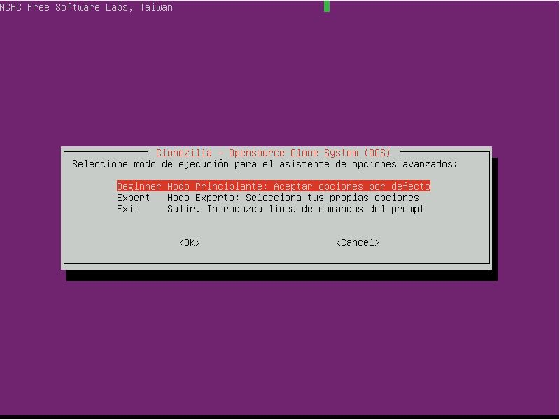

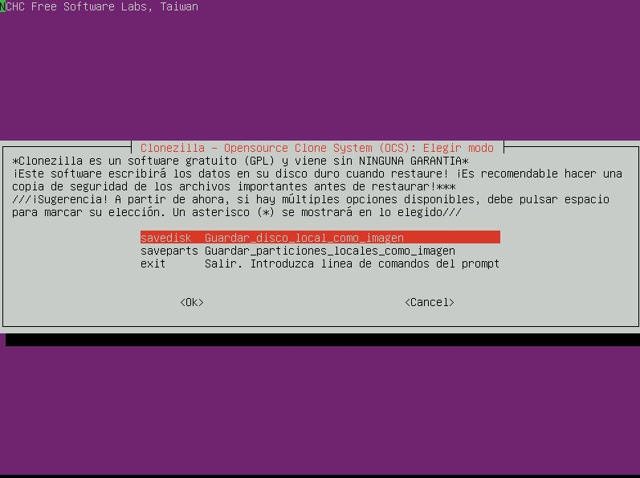

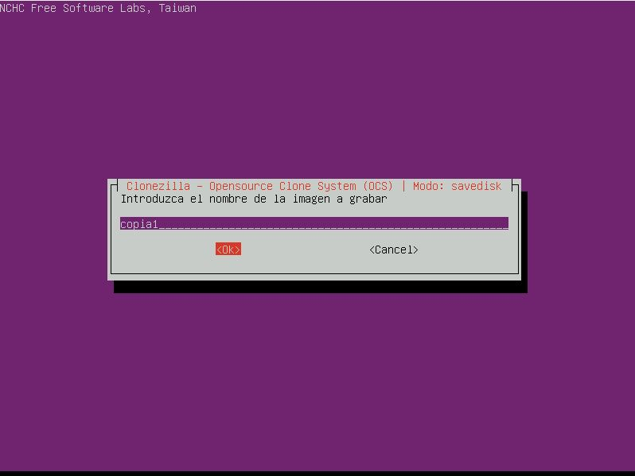

Seleccionamos el disco que queremos copiar.

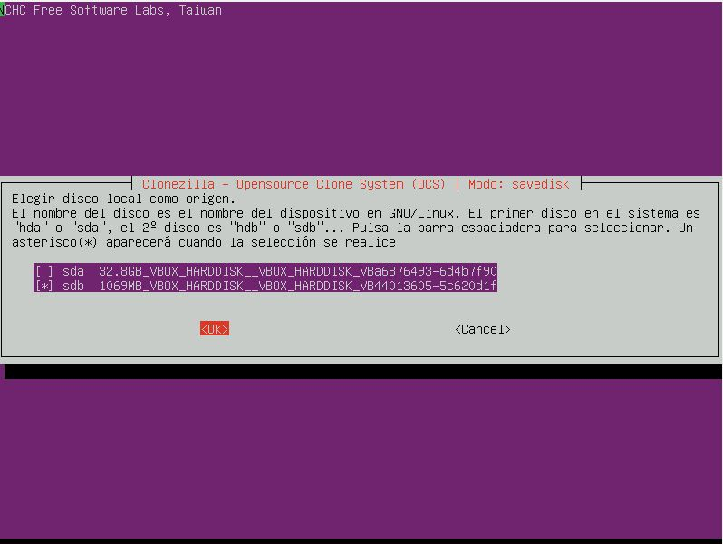

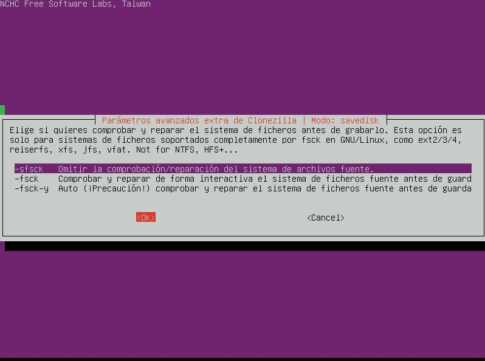

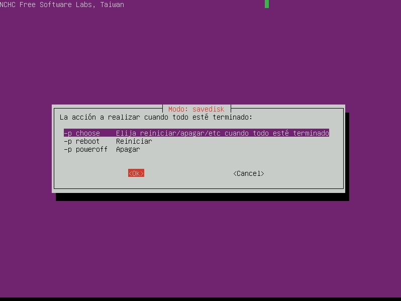

Y con está instrucción del asistente ya terminamos el proceso de copia.

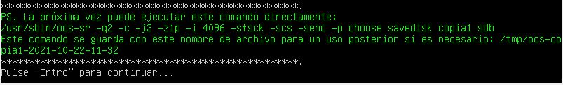
