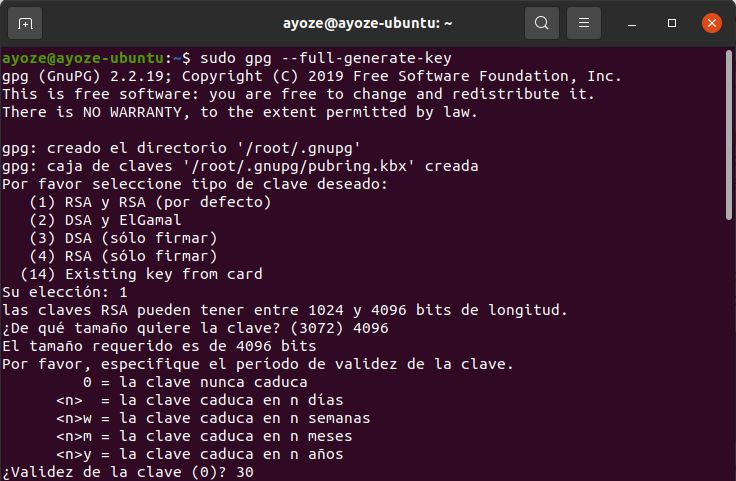
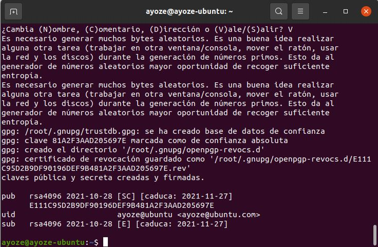
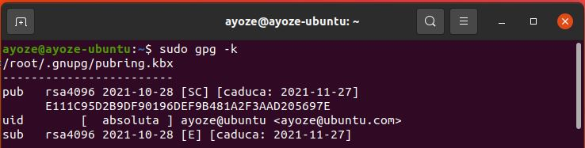
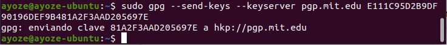
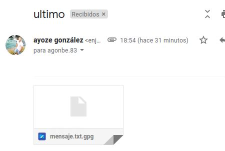
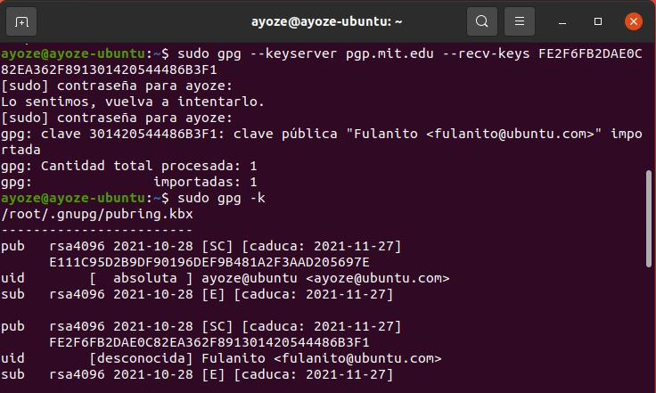
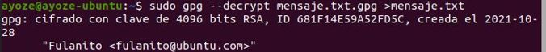
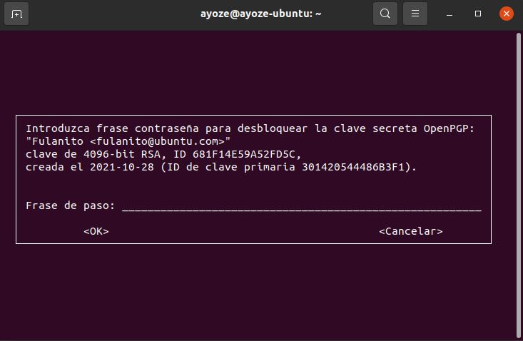
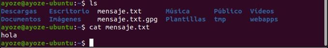

**UT2-A5 .Cifrado asimétrico con GPG**

Vamos a crear un par de claves público/privadas para cifrar nuestros mensajes.  
Para ello ejecutamos el siguiente comando y seguimos el asistente, intrudiciendo los párametros que creamos convenientes.  
Debemos introducir una contraseña para identificar las claves como propias.  
(Para generar entropía en la clave será necesario elevar los procesos de la gpu para que los datsos extraidos sean más aleatorios)

Con el comando ***sudo gpg -k*** podemos ver nuestro anillo de claves.

Vamos a exportar nuestra clave pública a un servidor de claves. Para ello ejecutamos el siguiente comando copiando la id de nuestra clave pública.

Ahora crearemos y encriptaremos un archivo para mandarselo a un compañero.

Nuestro compañero debe ejecutar ***gpg --import "nombre_del_archivo"*** para almacenar en su cartera de claves la clave que le hemos enviado.

En la terminal, nuestro compañero, importará la clave pública que hemos generado desde el servidor
(como podemos ver se ha importado nuestra clave y ahora figura en su anillo de claves junto a la suya).

Ahora ya puede desencriptar mi mensaje usando mi clave pública y mi frase de paso.

