**UT2-A6. Encriptado de información con Windows 7 y Windows 10.**

**Windows7**

Vamos a encriptar archivos con ***EFS*** en Windows7 y Windows10.

Iniciamos Windows7 y lo primero que haremos es entrar en el centro de cuentas y crearemos 2 perfiles nuevos "encriptado" y "normal", ambos con rol de administrador del sistema.

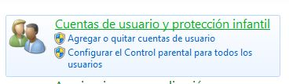

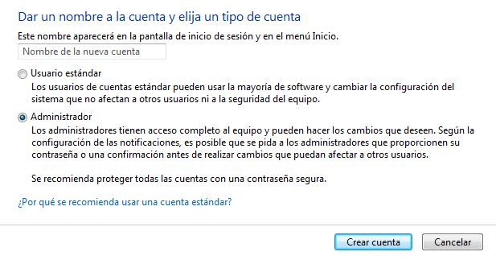

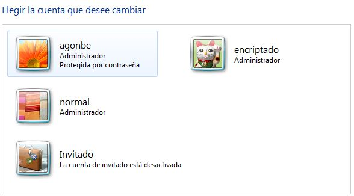

Una vez creados los perfiles, iniciamos sesión con el perfil de encriptado.

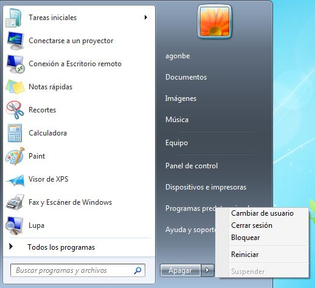

Una vez en el perfil, ejecutamos tecla windows + r para abrir la consola de busqueda, y dentro buscamos ***services.msc***.

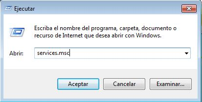

Dentro de servcios buscamos sistema de cifrado de archivos y con el botón derecho del ratón seleccionamos ***activar***.

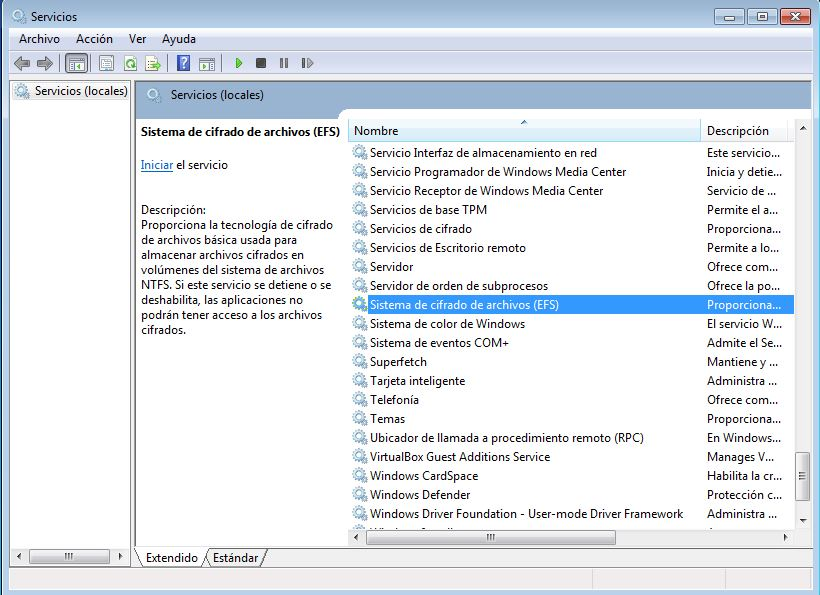

Ahora crearemos una carpeta en la ruta C:// con el nombre de ***Encriptar*** y luego en las propiedades de la carpeta, entraremos en ajustes avanzados y activaremos el cifrado.

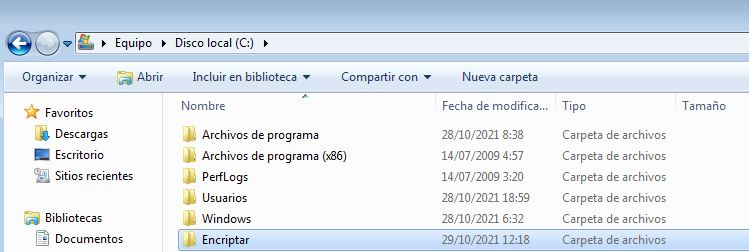

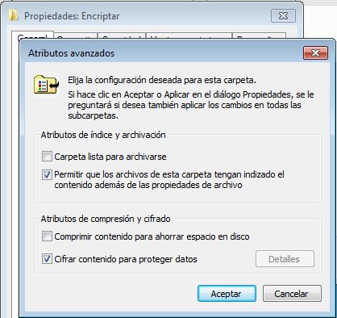

Nos dará la oportunidad de hacer una copia de seguridad con contraseña.

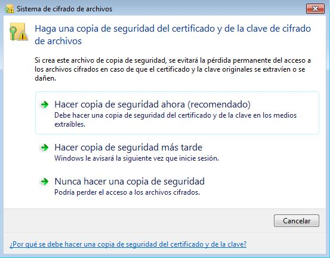

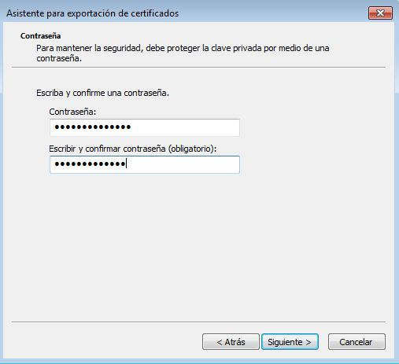

Una vez finalizado el asistente, vamos a crear un fichero de texto dentro de la carpeta para comprobar que nuestro usuario sigue teniendo acceso a la misma.

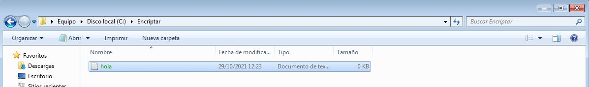

Vamos a cambiar de usuario y a intentar acceder al fichero que hemos creado.

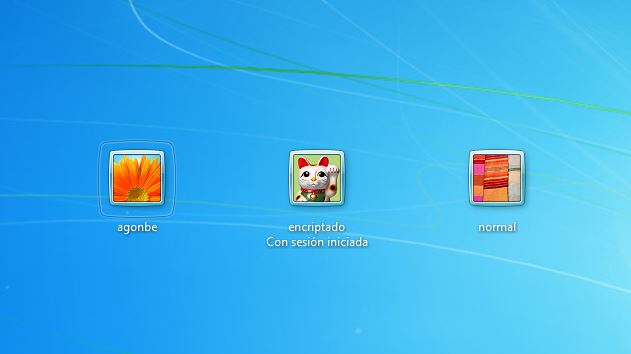

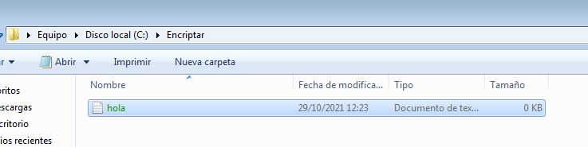

Al hacer doble click sobre el archivo, nos aparece un mensaje avisandonos que no tenemos permiso para acceder.

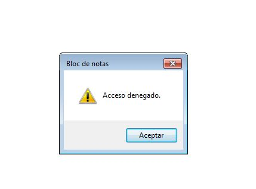

Al intentar desactivar el ***EFS*** vemos que el menú no esta habilitado para este usuario.

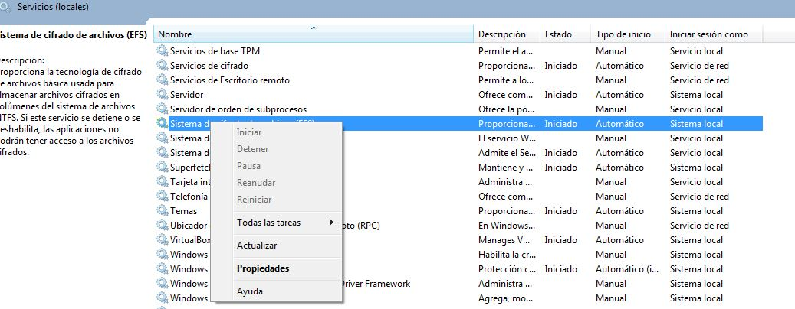

**Windows10**

Vamos a hacer la misma práctica con Windows10.
Comenzamos creando los usuarios.

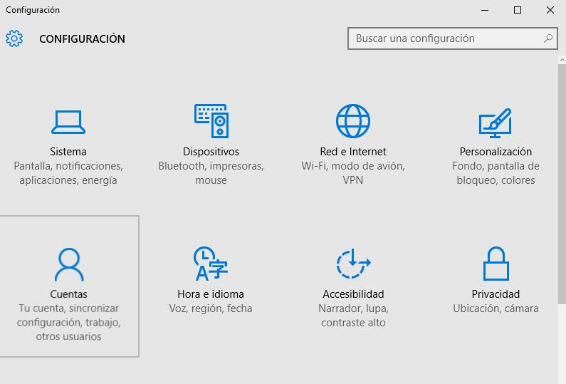

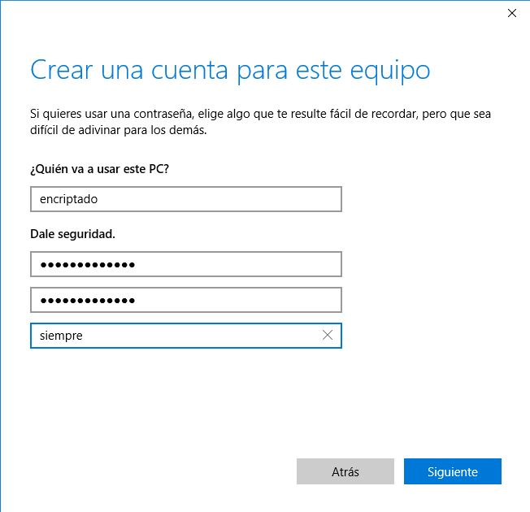

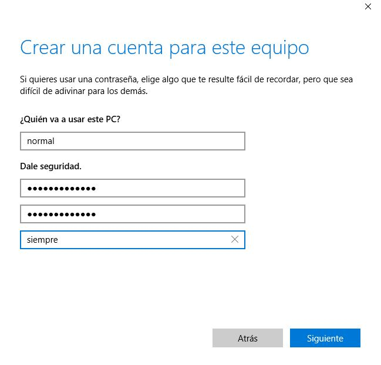

Una vez creados, les damos rol de administradores del sistema.

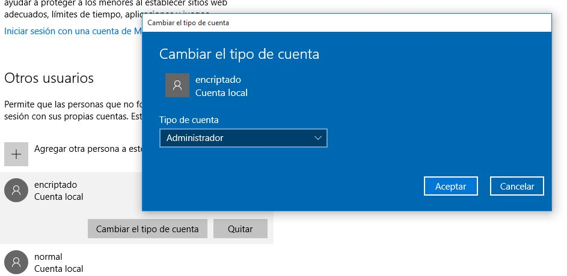

Cerramos sesión e iniciamos con la cuenta encriptado.

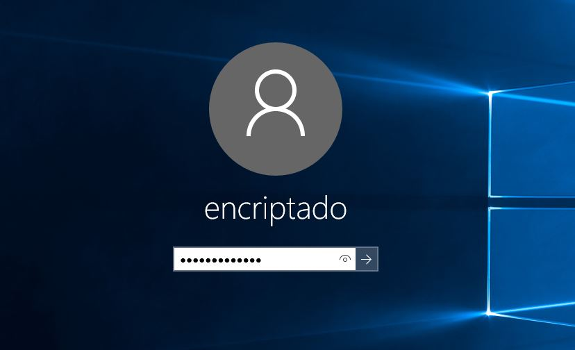

Con las teclas ***windows+r*** iniciamos el buscador y buscamos ***services.msc***

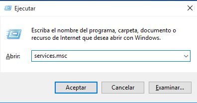

volvemos a buscar ***sistema de cifrado de archivos*** y lo activamos.

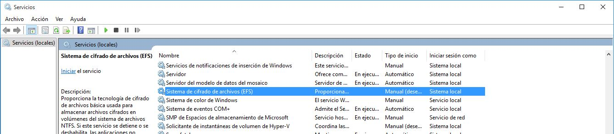

En el disco local C creamos de nuevo una carpeta con nombre ***Encriptar*** y ciframos el contenido.

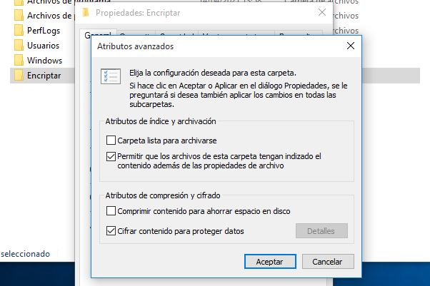

Creamos un nuevo fichero

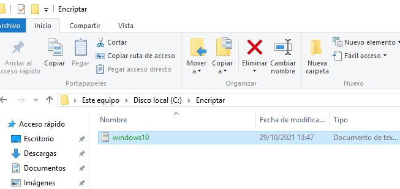

Cambiamos de nuevo de usuario e intamos acceder al fichero.

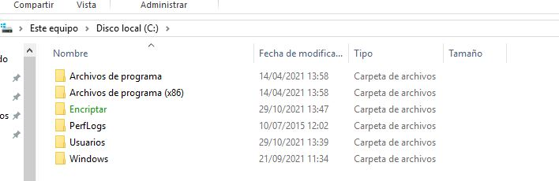

Una vez más nos sale el mensaje denegando el acceso.

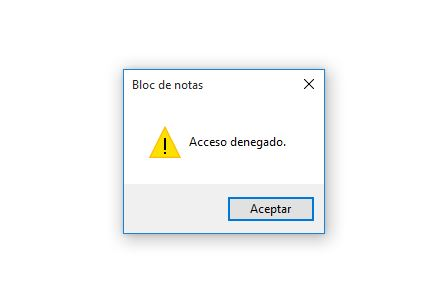

Entramos en servicios para intentar desactivar el ***EFS*** pero al igual que en Windows7 las opciones no estan habilitadas para este usuario.
