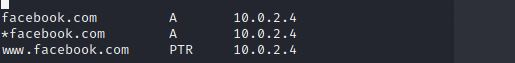
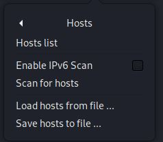
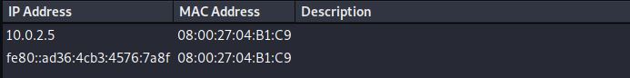
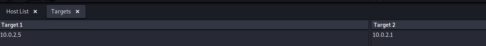
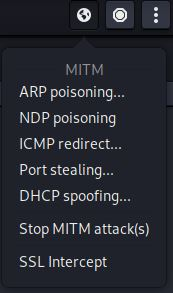
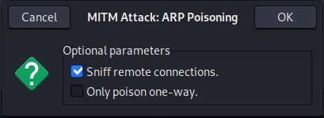
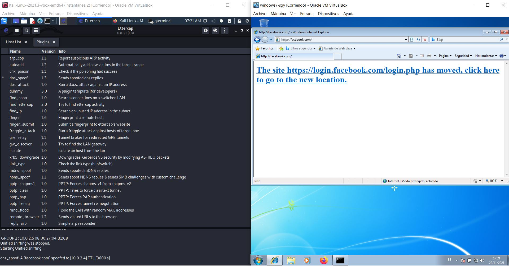
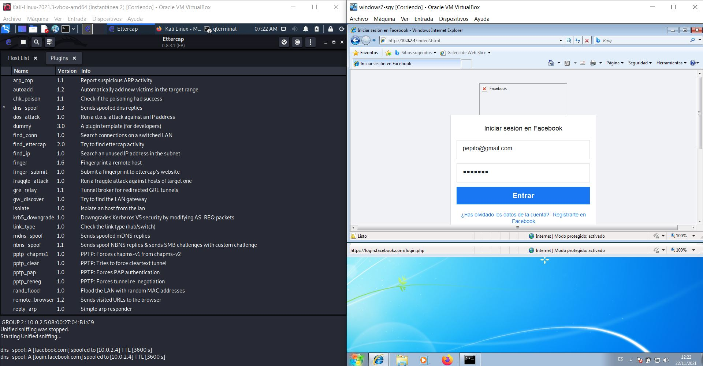
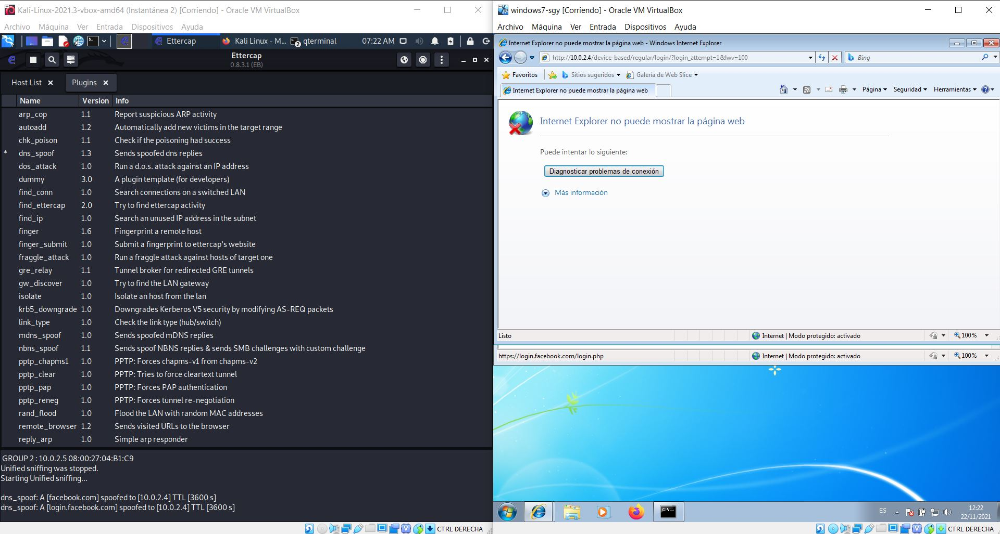
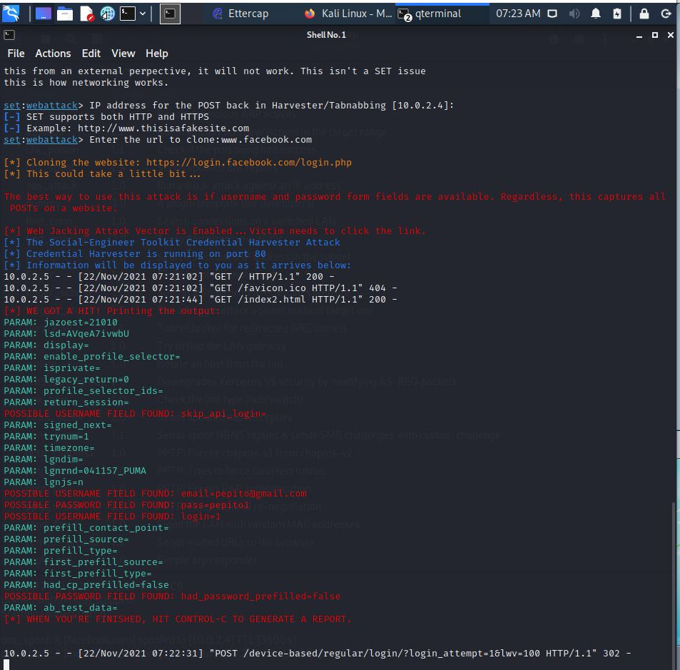

**UT3-A2. DNS Spoofing**  

En esta práctica vamos a intentar robar credenciales de acceso de un usuario, haciendonos pasar por la página legítima de login de Facebook.

En primer lugar editaremos el archivo ***/etc/ettercap/etter.dns*** para añadir los nombres de dominio que queremos que apunten a nuestra ip.

Una vez hecho esto, abrimos la herramienta ***ettercap*** de nuestro Kali-Linux.
En el menú elegimos la opcion Host list para ver las máquinas que tenemos en nuestra red.

En la parte inferior podremos ver las pestañas ***Add to target1*** y ***Add to target2*** donde debemos introducir la ip de la víctima y la puerta de enlace respectivamente.

Una vez seleccionadas las ip's, abrimos el menú ***MITM***, clicamos la opción ***ARP poisoning*** y marcamos la casilla ***Sniff remote connections***

De vuelta en el menú pricipal, seleccionamos la pestaña ***Pluggins*** y buscamos el protocolo ***Dns_Spoof*** que activaremos con doble click.
A partir de este momento podemos ver como la víctima se loguea en nuestra máquina al intentar acceder a facebook.com

Una vez introducidos los datos de acceso del usuario, la página le devuelbe un mensaje de error, pero nosotros ya tenemos las credenciales en nuestra máquina.

