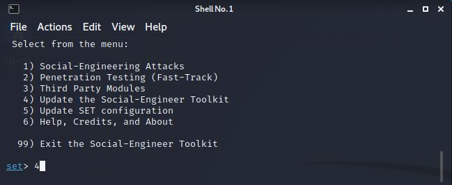
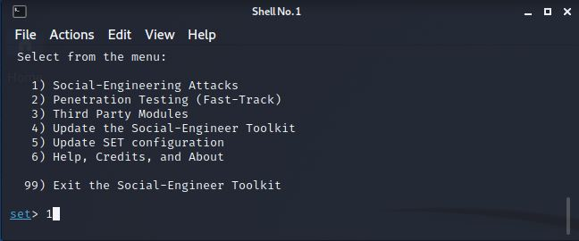
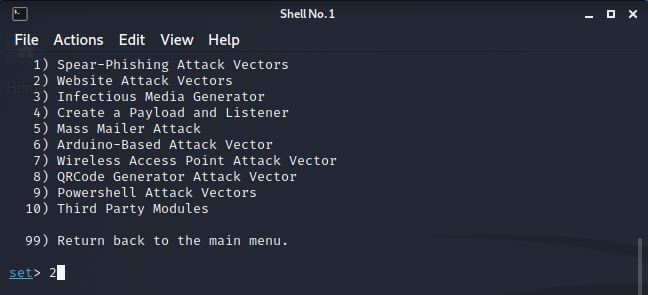
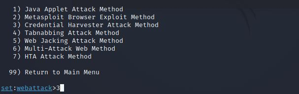
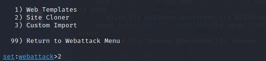
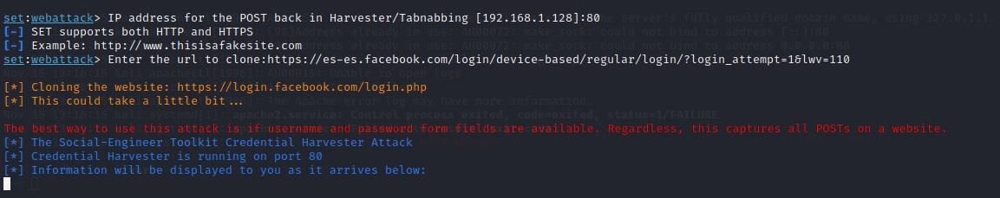
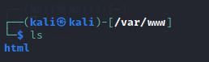
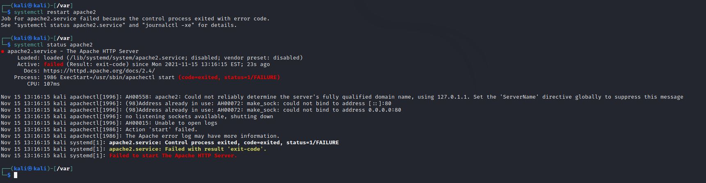

**UT3-A1. Phishing con SET (Social Engineering Toolkit)**

La finalidad de está práctica es interceptar los datos de login de facebook de la victima.
Para ello utilizaremos la herramienta ***Social Engineering Toolkit*** integrada en nuestra máquina ***kali linux***.

Al iniciar la herramienta nos pedirá que seleccionemos entre las distintas opciones disponibles.
En el primer menú elegiremos actualizar la herramienta.

Ahora iniciamos el programa.

En el siguiente menú selccionamos atacar una página web.

En la siguiente ventana seleccionamos el ataque de credenciales y luego clonar sitio.

Nos pedirá que declaremos nuestra ip y el puerto de escucha y, a continuación la url a clonar, donde podremos la página web de facebook.

Hecho estó, deberia crearnos una copia en ***/var/www/*** pero como podemos comprobar la carpeta esta vacía.

intente reiniciar ***apache*** pero me da error y no levanta el servicio.

