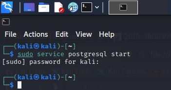
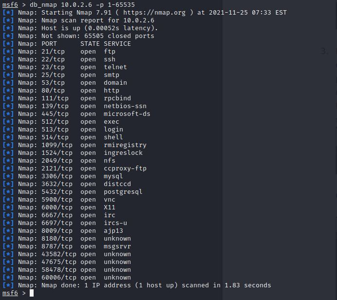
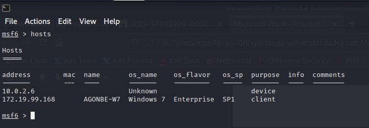
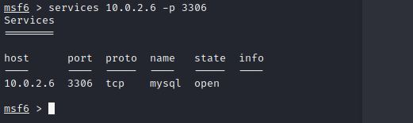
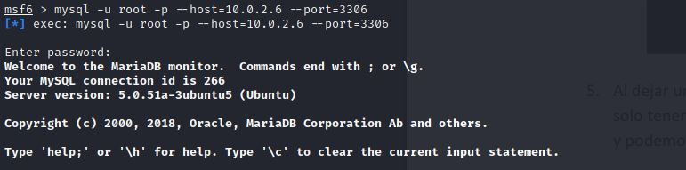
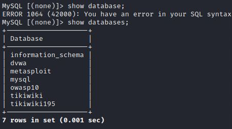
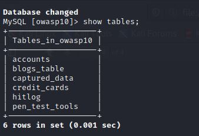
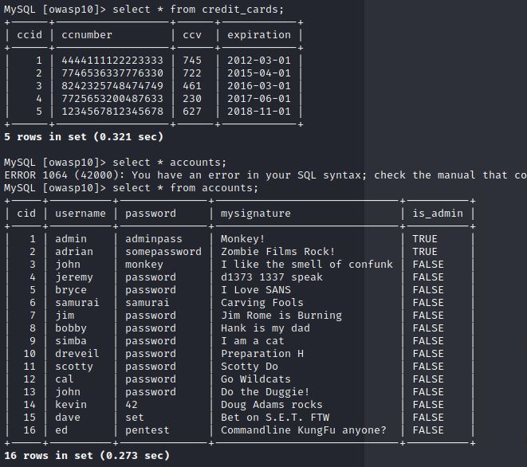

**UT3-A3. Explotando vulnerabilidades con Metasploit Framework VSFTPD y MySQL**

En está práctica simularemos las vulnerabildades que pueda tener un servidor para explotarlas con nuestro Kali-Linux.
En primera instancia, vamos a intentar acceder a una base de datos vulnerable.
Para ello, iniciamos nuestra base de datos de kali con el siguiente comando.

Iniciamos ***msfconsole*** y con el siguiente comando comprobamos los servcios y puertos abiertos.

Si invocamos el comando ***hosts*** nos muestra los hosts que han sido analizados.

Con el comando ***services***, la dirección ip de la víctima y el puerto, podemos ver el estado de un servcio en concreto.

Vamos a intentar acceder a la base de datos mediante el puerto que hemos encontrado abierto.

Una vez dentro vamos a ver que bases de datos hay disponibles.

Ahora buscaremos en las distintas bases de datos hasta encontrar información valiosa.

Como podemos ver en una simple busqueda hemos encontrado nombres de usuario con sus repectivas tarjetas de crédito.

