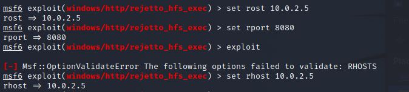

**UT3-A4. Hackeo de Windows, ejecución del modo comando desde Kali Linux**

En está práctica vamos a acceder en remoto a una máquina con windows7 aprovechando las vulnerabilidades del servidor instalado.

Para ello descargamos y arrancamos el servidor en cuestión.

Ahora desde nuestra máquina ***kali-linux***
vamos a hacer uso de ***nmap*** para escanear la ip de windows y comprobar si tienes servicios con puertos abiertos.  

Podemos ver que el puerto 8080 está abierto. Vamos a iniciar un navegador para ver si podemos encontrar más información del servicio.

Una vez identificado el servicio y el puerto, iniciamos ***msfconsole*** y realizamos una busqueda con el nombre del servidor que obtuvimos para comprobar si hay vulnerabilidades que podamos explotar.

Como podemos comprobar existe una vulneravilidad para ese servicio. Vamos a utilizarla con el comando ***use*** y el nombre de la vulnerabilidad.    
Con ***show options*** podemos ver las variables que nos brinda el exploit.

Vamos a definir la ip y puerto de nuestra víctima.

Y lo activamos.

Si miramos los regsitros del servidor en nuestra máquina Windows, podemos ver la intrusión.

De nuevo en la consola de kali podemos utilizar comandos para listar directorios o incluso hacer capturas de pantalla.

Con el comando ***download*** podremos descargarnos archivos en nuestra máquina.

Con el comando ***shell*** podemos abrir una terminal en nuestra víctima.

CON ***sysinfo*** podemos ver la información del sistema.

Con ***idletime*** podemos ver la última conexión de la víctima.

Con el comando ***upload*** podremos subir archivos desde nuestra máquina a la víctima.

Con el comando ***search*** podremos buscar archivos dentro de su disco duro.

Y con el comando ***route*** podremos ver e incluso modificar su tabla de rutas.

