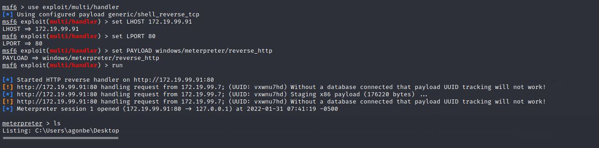

# UT3-A6. Uso de msfvenom y técnicas de evasión

***Nombre:*** Ayoze González Bello

***Curso:*** 2º de Ciclo Superior de Administración de Sistemas Informáticos en Red.

### ÍNDICE

+ [Introducción](#id1)
+ [Objetivos](#id2)
+ [Material empleado](#id3)
+ [Desarrollo](#id4)
+ [Conclusiones](#id5)

#### ***Introducción***. 

Vamos a generar ficheros con exploits ocultos en aplicaciones.

#### ***Objetivos***. 

Nuestro objetivo es engañar al usuario para que ejecute nuestro malware.

#### ***Material empleado***. 

- Kali linux
- Windows 7

#### ***Desarrollo***. 

Para esta práctica usaremos ***msfvenom*** para crear nuestro exploit. Para listar los enconders disponibles podemos ejecutar desde la terminal "msfvenom -l encoders".

En la primera parte de la práctica vamos a crear un archivo con nuestro malware al que llamaremos ***meterpreter.exe***  
Para ello ejecutamos el siguiente comando...

Una vez creado el archivo lo subimos a ***https://virustotal.com*** y comprobamos cuantos antivirus lo detectan.

Vamos a crear otro fichero con el encoder ***shikata*** con el siguiente comando...

y nuevamente lo subimos a la web para ver que resultado nos arroja.

Ahora vamos a ocultar nuestro malware en un archivo ejecutable, para engañar a nuestra víctima haciendola creer que ejecuta un programa legítimo. Para ello usaremos la aplicación ***putty***.
Vamos a descargar la aplicación desde su página oficial y una vez descargado lo alojamos en el directorio ***/usr/share/metasploit-framework/data/templates/***

Vamos a combinar nuestro exploit con el ejecutable que hemos descargado y lo llamaremos ***evilputty2*** para identificarlo.

Ya solo queda engañar a nuestra víctima para que lo descargue en su pc y lo ejecute.

Nosotros estaremos a la escucha desde nuestra terminal de kali.  
Y como podemos ver una vez el usuario ejecuta el programa ya estamos dentro de su pc.

### Metodos de Evasión

Vamos a utilizar la aplicación ***Veil*** para camuflar mejor nuestro malware.
Para ello nos ponemos como root e instalamos la aplicación en kali.

Una vez instalado lo configuramos con el comando ***/usr/share/veil/config/setup.sh --force***

Aceptamos la instalación de las dependencias necesarias para que se ejecute el programa.

Una vez configuarado lo llamamos con el comando ***veil***

y seleccionamos las opciones que queremos para nuestro exploit. En nuestro ejemplo elejimos ***Evasion***

Con el comando ***list*** vemos los payloads disponibles

seleccionamos ***cs/meterpreter/rev_http.py***

y lo cnfiguramos con nuestra ip y el puerto de escucha.

Una vez creado el archivo, lo subimos a ***https://virustotal.com*** y comprobamos como el ratio de detección a bajado considerablemente.

#### ***Conclusiones***. 

En conclusión hay diferentes formas de crear nuestro malware, y existen herramientas que nos ayudan a ocultarlo de los antivirus, pero en este tipo de ataques lo mas dificil siempre será conseguir que la victima lo ejecute en su pc. 
