

# UT4-A1 VPN en Linux

***Nombre:*** Ayoze González Bello

***Curso:*** 2º de Ciclo Superior de Administración de Sistemas Informáticos en Red.

### ÍNDICE

+ [Introducción](#id1)
+ [Objetivos](#id2)
+ [Material empleado](#id3)
+ [Desarrollo](#id4)
+ [Conclusiones](#id5)

#### ***Introducción***. 

El protocolo PPTP para instalar VPNs es el más ampliamente
reconocido y el más fácil de instalar y de configurar.

#### ***Objetivos***. 

El objetivo de la práctica es montar un servidor VPN.

#### ***Material empleado***. 

- Ubuntu 20.04
- Windows 10

#### ***Desarrollo***. 

En primer lugar debemos habilitar 2 tarjetas de red para nuestro servidor. Una en ***Red Nat*** y otra en ***red interna***, está ultima debe de tener una ip fija.

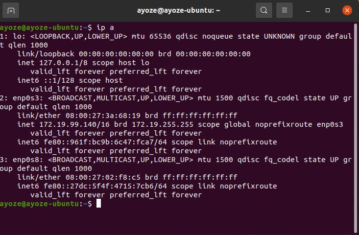

Para instalar el servicio, abriremos nuestra terminal de ubuntu y actualizamos los repositorios e instalamos el servicio con los siguientes comandos.

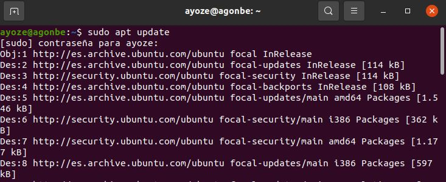

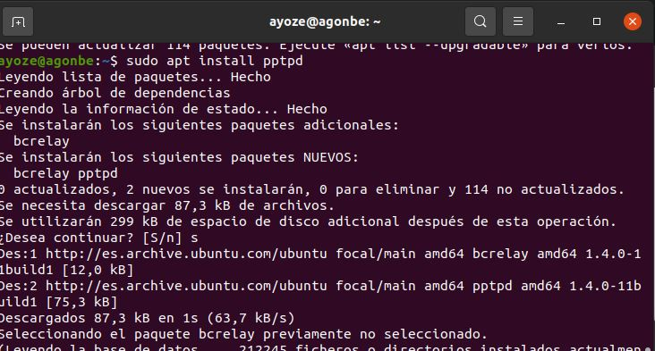

Editamos el archivo de configuración ***/etc/pptpd.conf*** descomentando las lineas ***localip*** y ***remoteip*** y añadiendo la dirección de nuestra red local y el rango de direcciones que queremos otorgar a nuestros clientes.

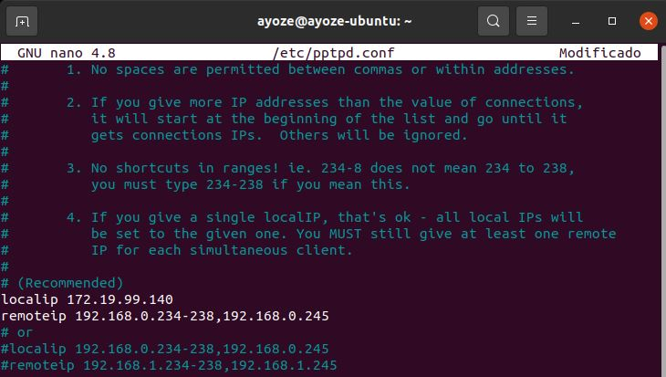

Ahora editamos ***/etc/ppp/chap-secrets***, en este fichero creamos los usuarios que se van a conectar de forma remota.

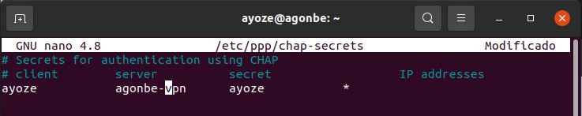

También editamos el fichero ***/etc/ppp/options*** asignando el nombre de nuestra VPN y dandoles los DNS que tenemos asignados en la tarjeta de red.

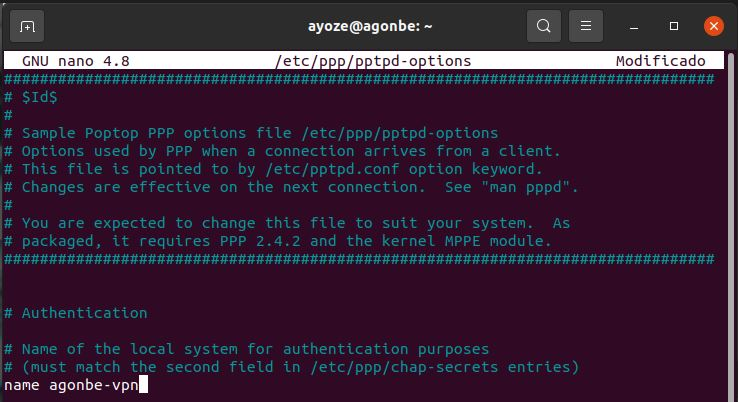

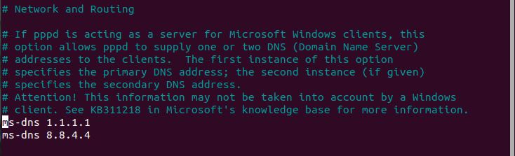

Revisamos el fichero ***/etc/sysctl.conf*** para activar el reenvio de paquetes, asigandole un 1 a la linea que observamos en la imagen en caso de estar desactivado.

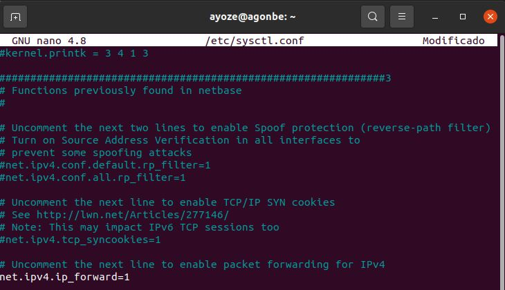

Por ultimo editamos el fichero ***/etc/systemd/system/rc.local.service*** dejandolo como en la imagen.

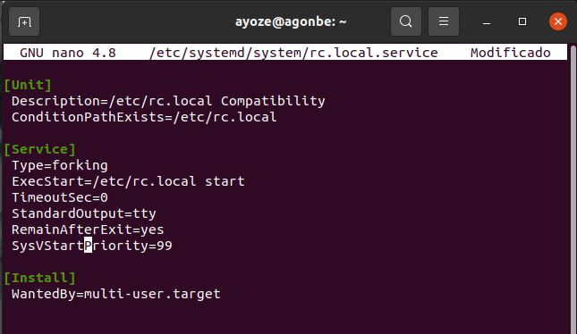

Para activar la Nat entre nuestras tarjetas de red ejecutamos el siguiente comando ***sudo iptables –t nat –A POSTROUTING –o enp0s3 –j MASQUERADE*** e incluimos la orden en el fichero ***/etc/rc.local***

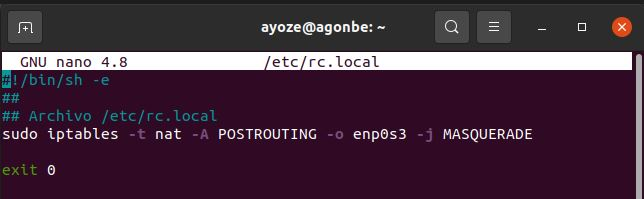

asignamos permisos de ejecución al fichero.

Habilitamos, activamos y comprobamos el servicio.

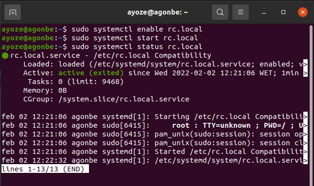

Vamos a conectarnos desde nuestro cliente Windows. Para ello nos vamos a la configuración de red y pulsamos en ***conectarse a un área de trabajo*** e introducimos la ip del servidor que hemos asignado a la VPN.

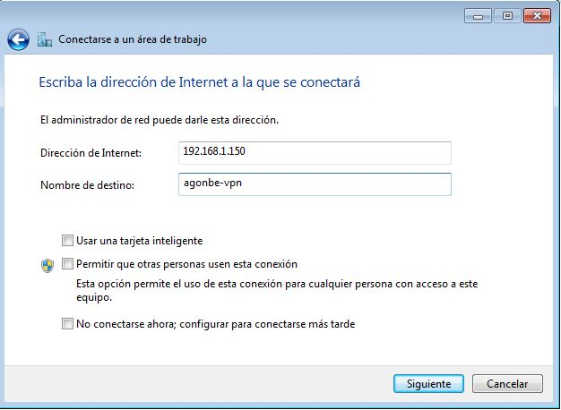

Intrroducimos nuestro ***usuario/contraseña*** y le damos a conectar.

y ya estamos conectados.

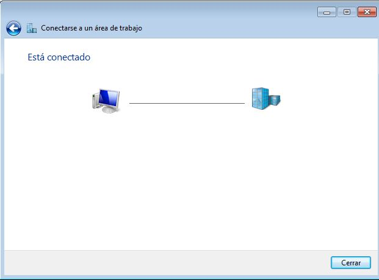

Comprobamos que tenemos conectividad y nuestra ip asignada.

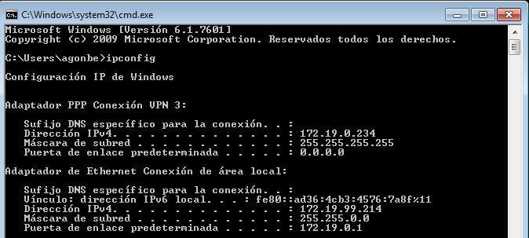

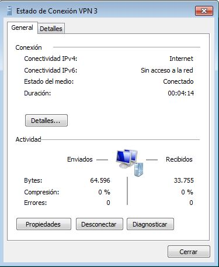

#### ***Conclusiones***. 

La implantación de este tipo de VPN's es bastante sencilla y efectiva pero requiere especial atención al modificar los ficheros de configuración para no tener problemas de conectividad.
