

# UT4-A2 VPN en Windows Server

***Ayoze Glez. Bello***

*** 2º de Ciclo Superior de Administración de Sistemas Informáticos en Red.***

### ÍNDICE

+ [Introducción](#id1)
+ [Objetivos](#id2)
+ [Material empleado](#id3)
+ [Desarrollo](#id4)
+ [Conclusiones](#id5)

#### ***Introducción***. 

Vamos a configurar un servidor vpn en Windows Server 2016.

#### ***Objetivos***. 

Vamos a crear una vpn y conectar un cliente con Windows 10.

#### ***Material empleado***. 

- Windows Server 2016
- Windows 10

#### ***Desarrollo***. 

Lo primero que debemos hacer es asignar una ip estática a nuestro servidor.

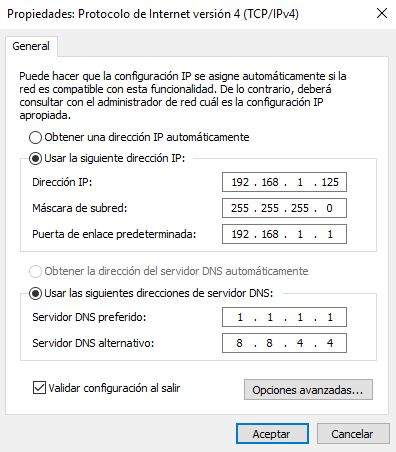

Ahora iniciamos nuestro panel administrador y agregamos los roles de ***active directory***, ***acceso remoto*** y ***enrrutamiento*** y aceptamos las caracteristicas que nos indique el asistente que necesitas instalar para el correcto funcionamiento de los servicios.

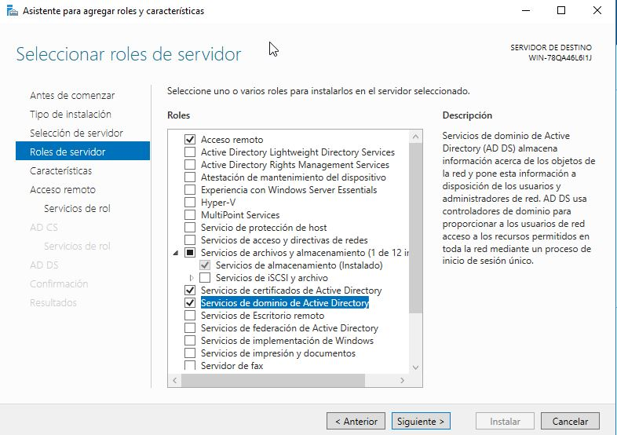

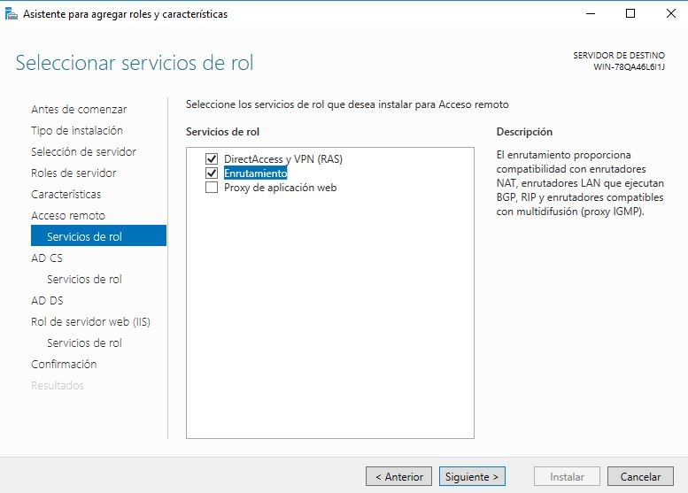

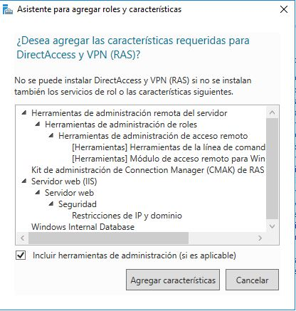

Ahora tendremos una nueva pestaña para gestionar el enrrutamiento y acceso remoto a nuestro servidor.

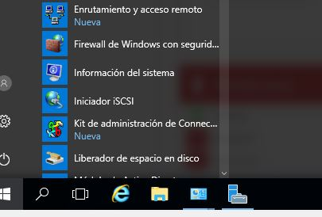

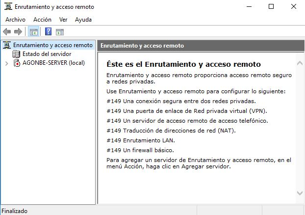

Haciendo click derecho sobre el nombre de nuestro servidor podremos acceder a la configuración.

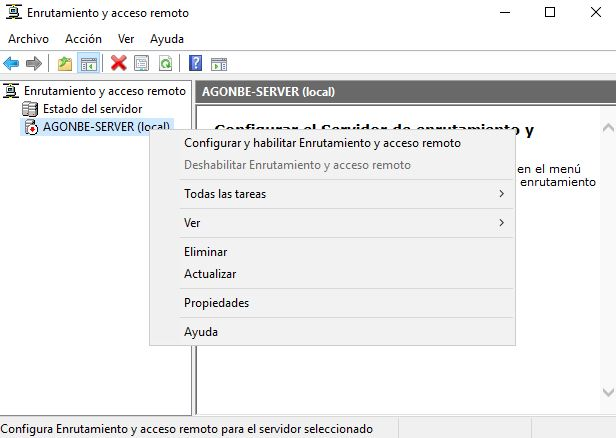

Seleccionamos la opción de ***Acceso a red privada virtual***

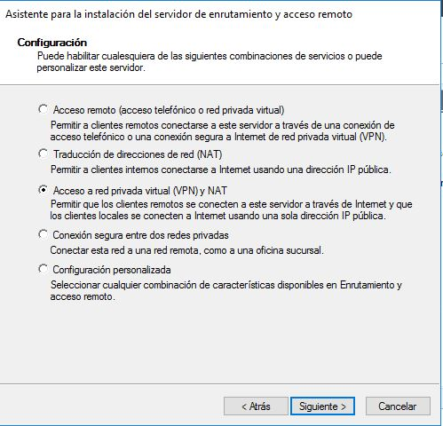

Seleccionamos la interfaz de red.

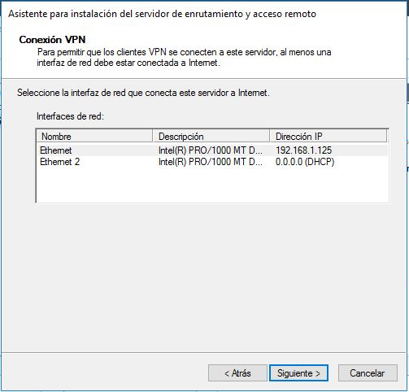

y siguiendo las indicaciones del asistente, seleccionamos agregar un intervalo de direcciones.

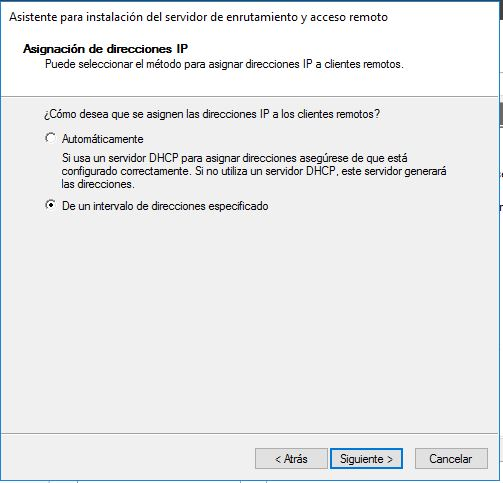

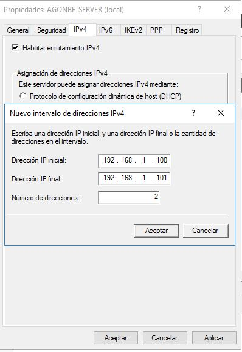

Seleccionamos la opción de usar enrrutamiento acceso remoto.

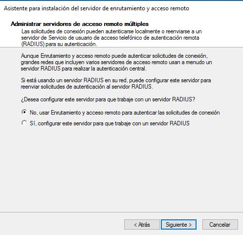

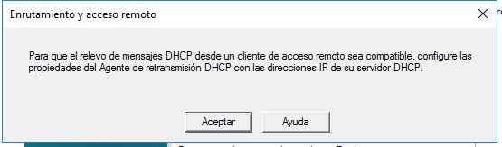

Una vez configurado volvemos a la pestaña inicial y desplegamos las subcategorias del servidor, para hacer click derecho en ***puertos*** y seleccionamos ***propiedades***

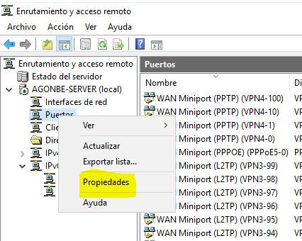

aquí reducimos el numero de puertos disponibles para los diferentes protocolos, priorizando los ***L2PT*** y marcando las casillas para permitir las conexiones, como se muestra en la imagen.

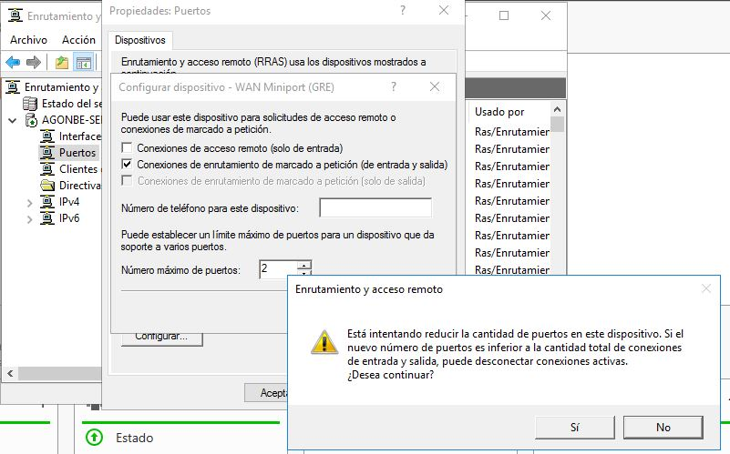

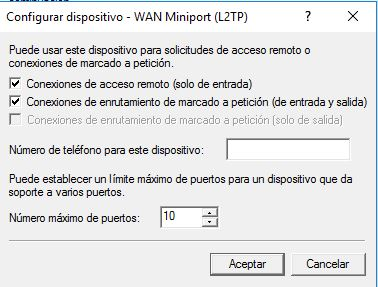

Ahora otra vez clicando sobre el nombre de nuestro servidor seleccionamos ***propiedades*** y nos vamos a la pestaña de ***seguridad*** para asignar la contraseña del servicio.

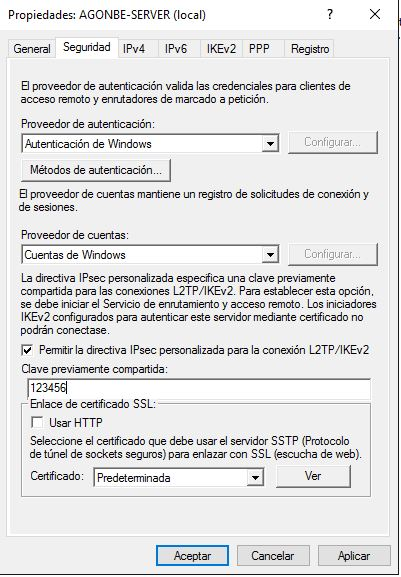

Una vez configurada la VPN nos dirigimos a ***active directory*** para crear un usuario autorizado para usar el servicio.

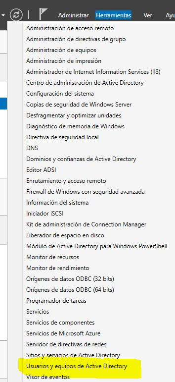

Creamos una nueva unidad organizativa a la que llamaremos ***vpn-users***

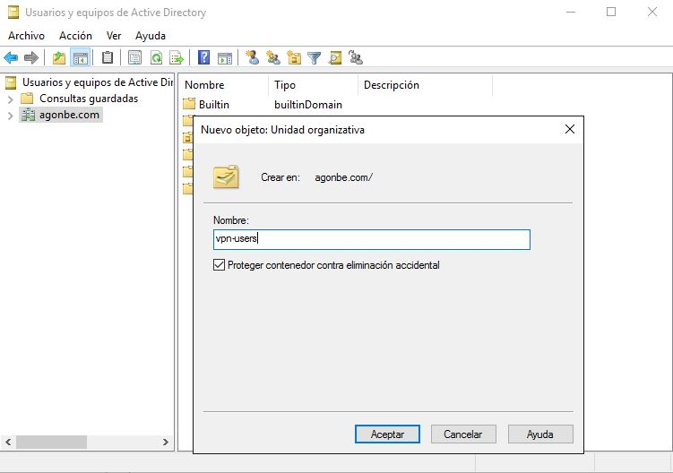

dentro de ella crearemos un nuevo usuario para nuestro servicio.

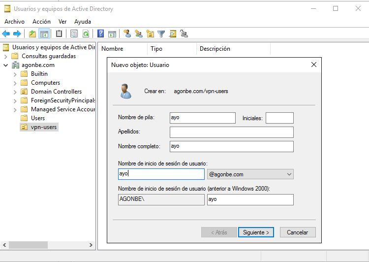

Le asignamos una contraseña y marcamos las pestañas que se muestran en la imagen.

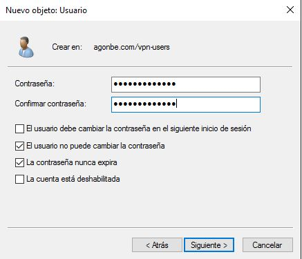

Una vez creado el usuario debemos hacer click derecho sobre el y abrir las propiedades. Dentro de estas buscamos la pestaña de ***marcado*** y marcamos ***permitir acceso***

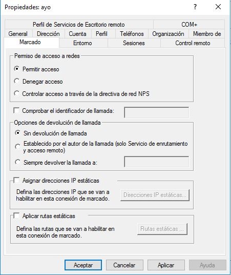

Ya tenemos listo el servidor, ahora abrimos el cliente y creamos la conexión.
Para ello abrimos el centro de recursos y redes y marcamos en la opción de VPN. Para crear la conexión simplemente introducimos la dirección ip del servidor, el nombre de usuario y la contreseña.

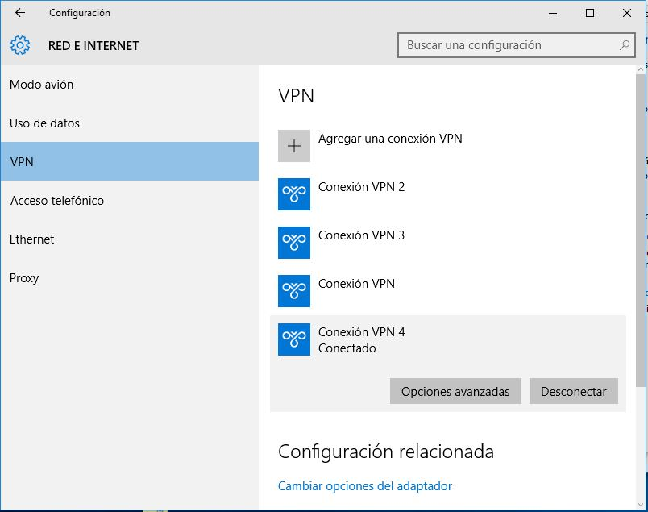

Como podemos ver en la imagen, ya estamos conectados y se nos a asignado una ip del rango que habiamos definido anteriormente.

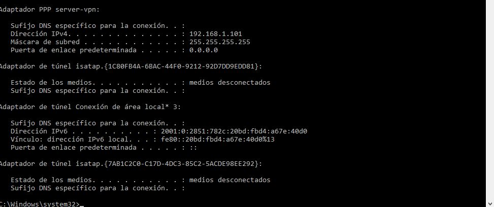

#### ***Conclusiones***. 

La implementación de este tipo de servidores es sencilla, pero es necesario conocer cada uno de los pasos correctamente porque el hecho de no marcar una sola casilla durante el proceso, hace que el servicio no pueda iniciarse correctamente.
