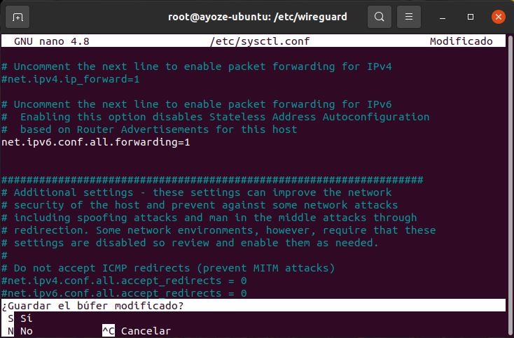

# UT4-A3 VPN WireGuard en Linux

***Ayoze Glez. Bello***

*** 2º de Ciclo Superior de Administración de Sistemas Informáticos en Red.***

### ÍNDICE

+ [Introducción](#id1)
+ [Objetivos](#id2)
+ [Material empleado](#id3)
+ [Desarrollo](#id4)
+ [Conclusiones](#id5)

#### ***Introducción***. 

WireGuard es un software libre que permite establecer una red privada virtual (VPN). Con la ayuda de una VPN se abre un túnel virtual entre dos ordenadores de Internet por el que pasa la conexión de red, como si se tratase de un cable de red entre los dispositivos. Las VPN son usadas a menudo por grandes organizaciones como institutos de investigación, organismos públicos y empresas. Gracias a ellas puede regularse el acceso a ciertos recursos de la red y las transferencias de datos de los usuarios pueden protegerse de cara al exterior.

#### ***Objetivos***. 

Vamos a implementar ***Wireguard*** en nuestro servidor de ***Ubuntu***, para crear una red segura a traves de VPN.

#### ***Material empleado***. 

- Servidor Ubuntu
- Cliente Linux Mint

#### ***Desarrollo***. 

Lo primero que debemos hacer es actualizar los repositorios y decargar el paquete de Wireguard en nuestro servidor.

Una vez instalado, nos movemos al directorio principal del servicio ***/etc/wireguard*** y creamos un par de claves público/privadas para el servidor y otro par para el cliente.

Asiganmos permisos al directorio para que solo el usuario root pueda gestionarlo.

Y creamos el archivo de configuración del servicio.          
En este fichero crearemos una sección llamada ***Interface*** con los siguientes campos:
- Address (IP del servidor para la red VPN)
- PrivateKey (Clave privada del servidor)
- ListenPort (Puerto asignado al servicio)
- PostUp y PostDown (Scripts para enmascaramiento de la IP)

Crearemos una segunda sección llamada ***Peer*** para nuestro cliente (en caso de tener más de uno, crearíamos un Peer para cada uno) con los siguientes campos.
- PublicKey (Clave pública del cliente)
- AllowedIPs = (IP que se le asignará al cliente para la VPN)
- PersistentKeepAlive (Tiempo que transcurrira para que el cliente mandé paquetes a traves del túnel evitando que se cierre).

Una vez configurado el fichero, activamos la interfaz de red con los siguientes comandos.

Y como podemos comprobar ya tenemos el servcio activo.

Nos queda entrar al fichero de configuración ***/etc/sysctl.conf*** y descomentar la siguiente linea asegurandonos que este en 1.

Con esto completariamos la configuración del servidor. ahora tendriamos que copiar de alguna forma la clave privada del cliente y la publica del servidor para hacersela llegar a nuestra máquina cliente.

Ya desde nuestro cliente, nos dirigimos a la terminal e instalamos el servicio.

Nos logueamos como root y nos dirigimos al directorio principal del servicio. Creamos una carpeta para nuestras claves y copiamos las claves que previamente nos habiamos ytraido desde el servidor.

Vamos a crear el archivo de configuración como hicimos en el servidor, pero esta vez a la inversa, es decir, con los datos del cliente en ***Interface*** y los del servidor en ***Peer***. (Muy importante, en la linea ***EndPoint*** se ha de poner la ip pública del servidor y abrir previamente el puerto en el router. En nuestro caso omitimos esa parte al no tener acceso al router en cuestión)

Una vez hecho esto, levantamos el servcio, primero con el comando ***systemctl enable wg-quick@wg0*** para hacer los cambios permanentes. Luego con ***systemctl start wg-quick@wg0*** para activarlo y por último con ***systemctl status wg-quick@wg0*** para comprobar que funciona correctamente.

Comprobamos que se ha creado correctamente la interfaz de red.

Como podemos ver ya se ha creado el túnel entre nuestras máquinas mediante la VPN de Wireguard.

#### ***Conclusiones***. 

Wireguard es una solución VPN de código libre, rápida y segura.
su implementación es sencilla, siempre que tengas claros los pasos a seguir y acceso al router para poder gestionar los puertos.
