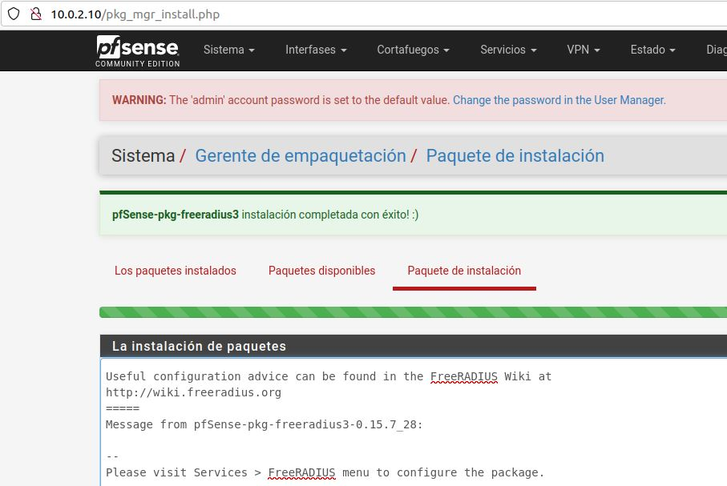
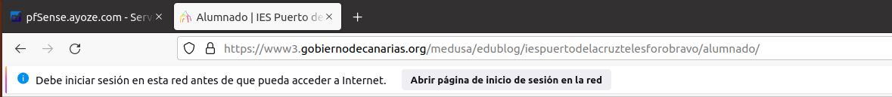

# UT4-A4 Instalación y configuración den servidor WifiRadius con PFSENSE

***Ayoze Glez. Bello***

*** 2º de Ciclo Superior de Administración de Sistemas Informáticos en Red.***

### ÍNDICE

+ [Introducción](#id1)
+ [Objetivos](#id2)
+ [Material empleado](#id3)
+ [Desarrollo](#id4)
+ [Conclusiones](#id5)

#### ***Introducción***. 

El estándar 802.1X nos permite realizar una conexión segura a puntos de acceso de red inalámbrica, centralizando la seguridad de todos los dispositivos de una red sobre una única base de datos de usuarios y contraseñas (servidor RADIUS).

#### ***Objetivos***. 

Vamos a implementar un sistema de autentificación y autorización de usuarios en la red, mediante ***RADIUS  (Remote Authentication Dial-In User Server*** instalado en nuetro firewall ***Pfsense***.

#### ***Material empleado***. 

- Servidor Pfsense
- Cliente Ubuntu

#### ***Desarrollo***. 

Lo primero que debemos hacer es configurar nuestro servidor de Pfsense (en caso de no haberlo configurado antes). Para ello, pondremos 2 adaptadores de red uno con el rol de ***WAN*** y ***LAN***.

Ahora desde otro host accederemos al administrador de pfsense mediante su ip y los datos de acceso por defecto del sistema.

Antes de configurar nuestro RADIUS vamos a realizar algunos ajustes generales en el servidor, como el nombre de host, dominio, ip de la interfaz LAN, puerto asignado para las conexiones, etc ...

En la pestaña ***Servicios/servidor DHCP/LAN*** marcamos la pestaña habilitar y elegimos un rango de direcciones para asignar a nuestros clientes.

Ahora vamos a conectarnos desde nuestro cliente mediante red interna a la ip LAN de nuestro servidor, y como podemos ver nos asigna una de las ip's que habiamos definido en el rango disponible.

Una vez acabadas las configuraciones iniciales, volvemos a nuestro servidor y nos vamos al gestor de paquetes para instalar ***RADIUS***.

Ya podemos configurar el servcio desde la pestaña ***Servicios/FreeRADIUS***

Seleccionamos la opción de ***NAS/Clients*** y rellenamos las casillas con los datos del servicio y una contraseña para el mismo.

En la pestaña interfaces asignamos la LAN, el puerto que usaremos, y dejaremos el resto por defecto.

Asignaremos un segundo puerto al servcio esta vez con la opción de ***Contabilidad*** en el tipo de interfaz.

Ahora vamos a crear los usuarios autorizados para el servicio, dandoles unicamente nombre y contraseña.

Vamos a activar el ***Portal Cautivo***, para ello nos dirijimos a ***Servicios/Portal Cautivo/portalasir/Configuración*** y marcamos la pestaña ***Habilitar***.

Por último nos dirigimos a ***Sistema/Gestión de Usuarios/Servidores de Autentificación/Editar*** y rellenamo las casillas con los datos que hemos habilitado para el servicio.

También dejaremos marcadas las siguientes pestañas y guardamos.

Ya hemos terminado la configuración del servicio. Ahora desde el cliente intentamos navegar a alguna página y vemos que nos pide autenticarnos en el servicio para continuar.

#### ***Conclusiones***. 

Implementar este tipo de servicios puede ser muy util para proteger tu red de una forma efectiva. Ademas el hecho de poder gestionar el servicio desde una interfaz gráfica hace sumamente sencillo su uso.
