

# UT4-A5 Instalación y configuración de OpenVPN en pfSense

***Ayoze Glez. Bello***

*** 2º de Ciclo Superior de Administración de Sistemas Informáticos en Red.***

### ÍNDICE

+ [Introducción](#id1)
+ [Objetivos](#id2)
+ [Material empleado](#id3)
+ [Desarrollo](#id4)
+ [Conclusiones](#id5)

#### ***Introducción***. 

OpenVPN es tanto un protocolo VPN como un software que utiliza técnicas VPN para asegurar conexiones punto a punto y de sitio a sitio. Actualmente, es uno de los protocolos VPN más populares entre los usuarios de VPN.

#### ***Objetivos***. 

Vamos a implementar ***OpenVPN*** para crear una conexión segura entre los clientes remotos y nuestra red interna instalando el servidcio en nuestro servidor ***Pfsense***.

#### ***Material empleado***. 

- Servidor Pfsense
- Cliente Ubuntu

#### ***Desarrollo***. 

Ya hemos hecho las configuaraciones iniciales en nuestro servidor ***Pfsense*** en prácticas anteriores por lo que no explicaremos el procedimiento aquí.  
El primer paso será ir a nuestro gestor de paquetes y buscar el servicio para instalarlo.

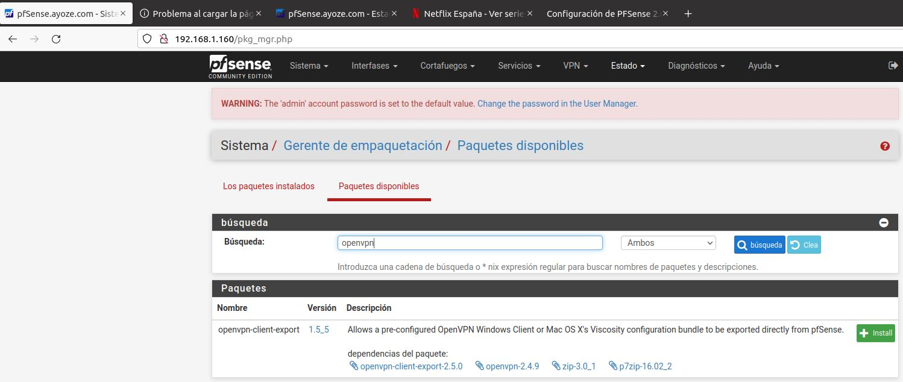

A continuación vamos a la pestaña ***Sistema/Gestor de Certificados/CAs/Editar*** y rellenamos los campos con los siguientes datos para crear nuestro certificado.

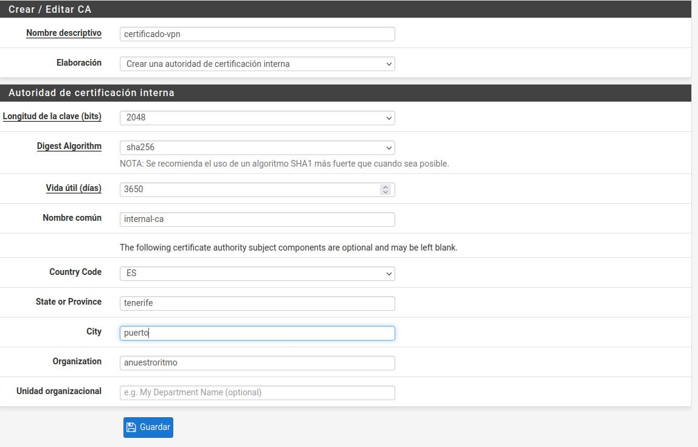

Una vez generado el certificado, nos dirigimos a ***Sistema/Gestión de Usuarios/Usuarios*** y creamos nuestro usuario autorizado asignandole un nombre, contraseña y el certificado que hemos creado en el paso anterior.

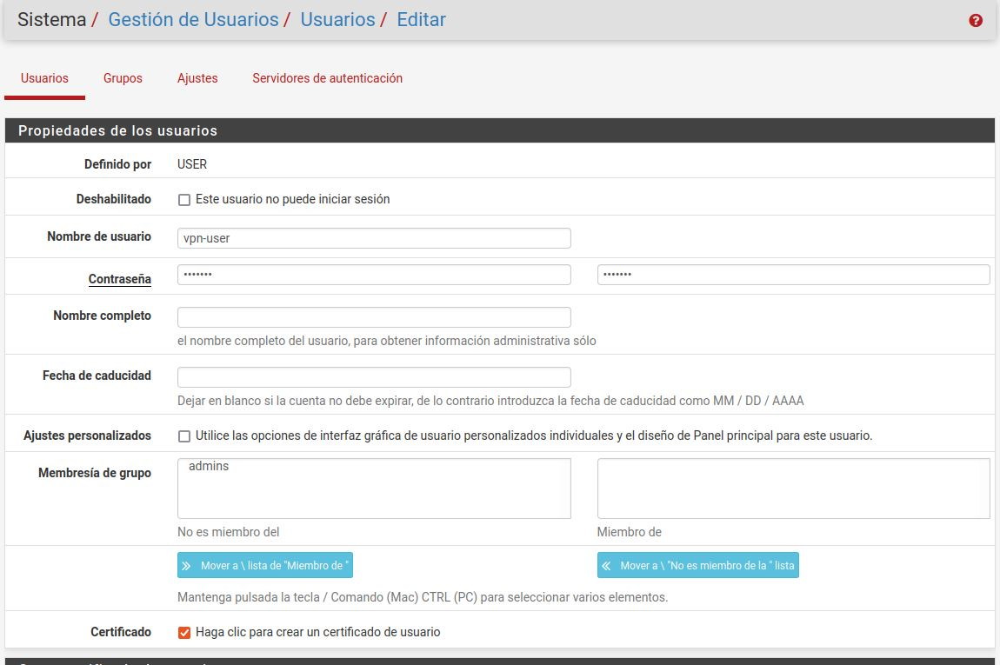

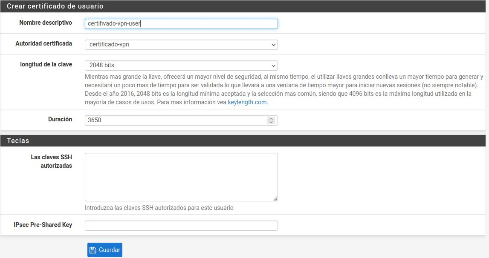

Ahora nos dirigimos al asistente de ***OpenVPN*** y en tipo de servidor seleccionamos ***Acceso a usuarios locales*** y presionamos siguiente.

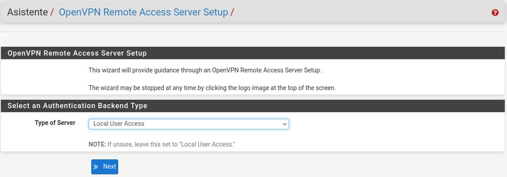

En la pestaña ***Elegir Autoridad Certificadora*** seleccionamos nuestro certificado.

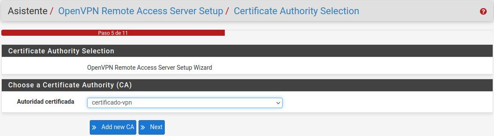

En ***Configuración de Túnel*** asignamos en ***Red Túnel*** nuestra ***WAN*** y en ***Local Network*** nuestra ***LAN***

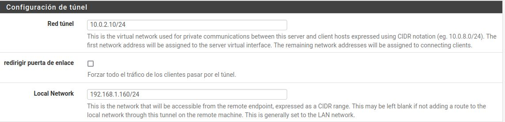

Habilitamos las reglas del firewall para permitir las conexiones al servdidor a través del VPN.

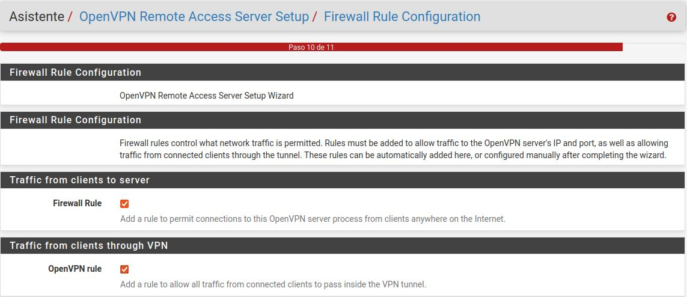

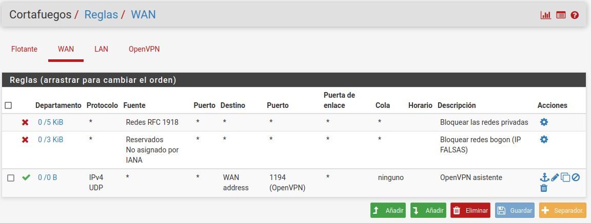

Y ya tenemos lista nuestra VPN del lado del servidor. Ahora pulsaremos en ***Client Export*** para generar un ejecutable para el cliente que cree el puente para la conexión a nuestra VPN.

Ahora nos dirigimos al cliente y desde la terminal instalamos el ejecutable que previamente hemos debido traer desde el servidor.

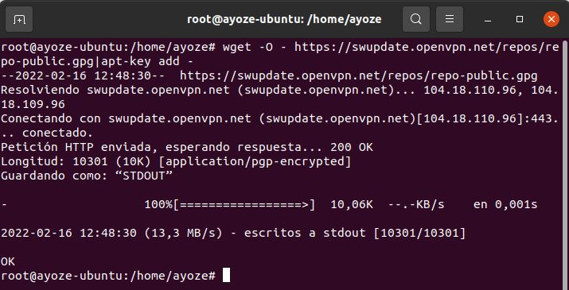

Y añadimos la conexión VPN.

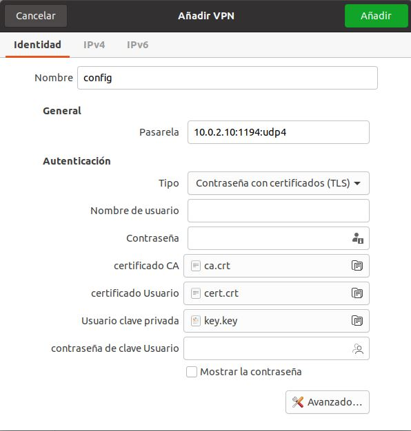

#### ***Conclusiones***. 

Esta solución VPN resulta sencilla de implementar y muy segura, y por ello resulta una de las mejores opciones para implementar VPN a nivel empresarial.
